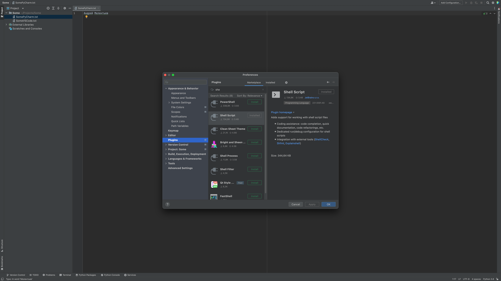
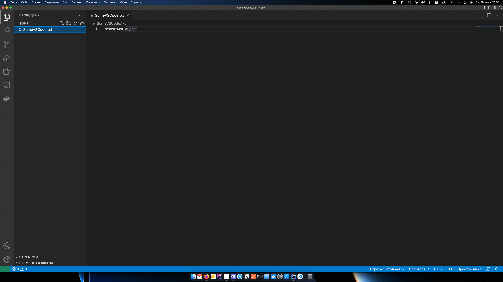
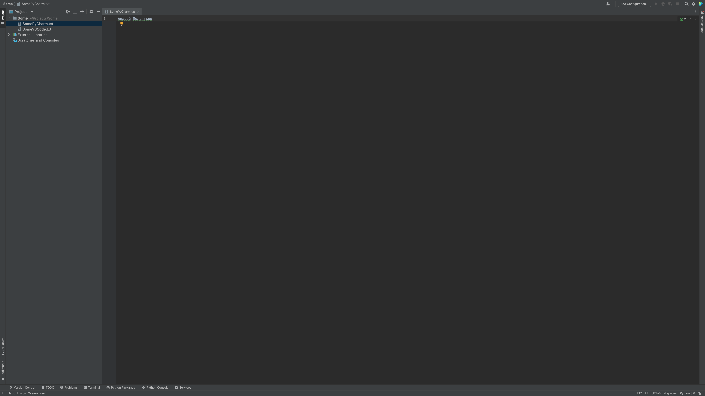

# Домашнее задание по лекции "Развитие в DevOps"

### 1. Установленый Shell Script 

### 2. Созданный файл SomeVSCode.txt в редакторе кода Visual Studio Code

### 3. Созданный файл SomePyCharm.txt в IDE PyCharm Community Edition
