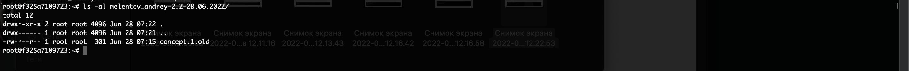

# Домашнее задание к занятию "2.2 Основы работы с командной строкой"

#### [Задание 1.](#задание-1)
#### [Задание 2.](#задание-2)
#### [Задание 3.](#задание-3)
#### [Задание 4.](#задание-4)
#### [Задание 5.](#задание-5)
#### [Задание 6.](#задание-6)
#### [Задание 7.](#задание-7)

---

### Задание 1 ([Текст Задания](https://github.com/netology-code/slin-homeworks/blob/slin-7/2-02.md#%D0%B7%D0%B0%D0%B4%D0%B0%D0%BD%D0%B8%D0%B5-1))

Сразу хочу уточнить у меня нет возможности работать с обычной виртуальной машиной так как ни одна программа для 
виртуализации кроме Doker не поддерживает АРМ процессоры. Так что я начал использовать Докер для выполнения домашней работы
В качестве доказательства что это действительно моя работа скрин, с профилем на нетологии, 
докера и консоли которая подключена к докеру.


---

### Задание 2 ([Текст Задания](https://github.com/netology-code/slin-homeworks/blob/slin-7/2-02.md#%D0%B7%D0%B0%D0%B4%D0%B0%D0%BD%D0%B8%D0%B5-2))
Выполненные команды:
```bash
echo Melentev Andrey; echo `date +"%d-%m-%y-lecture-2.2(hw-04)"`; cat /etc/os-release 
```
Результат работы

---

### Задание 3 ([Текст Задания](https://github.com/netology-code/slin-homeworks/blob/slin-7/2-02.md#%D0%B7%D0%B0%D0%B4%D0%B0%D0%BD%D0%B8%D0%B5-3))
Выполненные команды:

```bash
mkdir melentev_andrey-2.2; ls -al
```

Результат работы:


---

### Задание 4 ([Текст Задания](https://github.com/netology-code/slin-homeworks/blob/slin-7/2-02.md#%D0%B7%D0%B0%D0%B4%D0%B0%D0%BD%D0%B8%D0%B5-4))
```bash
mv -v melentev_andrey-2.2 ~/melentev_andrey-2.2-`date +%d.%m.%Y`;
```


---

```bash
touch concept.1; cat /etc/os-release > concept.1; echo Melentev Andrey >> concept.1; echo lecture-2.2-hw-04 >> concept.1;
```


---

```bash
cat concept.1 | grep Melentev
```


---

### Задание 5 ([Текст Задания](https://github.com/netology-code/slin-homeworks/blob/slin-7/2-02.md#%D0%B7%D0%B0%D0%B4%D0%B0%D0%BD%D0%B8%D0%B5-5))
```bash
cd /opt; ln -s ~/melentev_andrey-2.2-28.06.2022/ melentev_andrey-2.2-28.06.2022
```


---

```bash
cp -v opt/melentev_andrey-2.2-28.06.2022/concept.1 /opt/melentev_andrey-2.2-28.06.2022/concept.1.old
```


---

Проверяем что все работает корректно:
```bash
ls -al /opt/melentev_andrey-2.2-28.06.2022/
```


```bash
ls -al ~/melentev_andrey-2.2-28.06.2022/
```


---
Удаляем оригинал:
```bash 
rm melentev_andrey-2.2-28.06.2022/concept.1
```


---



---

### Задание 6 ([Текст Задания](https://github.com/netology-code/slin-homeworks/blob/slin-7/2-02.md#%D0%B7%D0%B0%D0%B4%D0%B0%D0%BD%D0%B8%D0%B5-6))

```bash
sudo apt update; sudo apt dist-upgrade
```
На скринах SUDO не работает я так понял какая-то особенность докер образа. 


---

```bash
sudo apt install mc vim
```


---

### Задание 7 ([Текст Задания](https://github.com/netology-code/slin-homeworks/blob/slin-7/2-02.md#%D0%B7%D0%B0%D0%B4%D0%B0%D0%BD%D0%B8%D0%B5-6))

Подтверждение, что это запущенно на моей виртуальной машине


---

Установка neofetch

```bash
pacman -Sy neofetch
```


---
Аналог задания №2 только информацию выводим через neofetch.

```bash
echo Melentev Andrey; echo `date +"%d-%m-%y-lecture-2.2(hw-04)"`; neofetch
```


---

