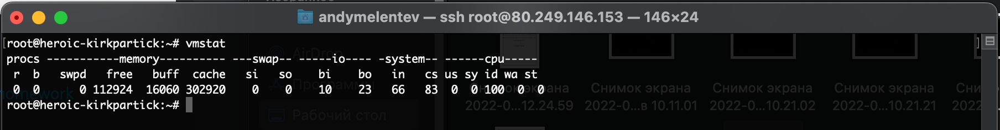
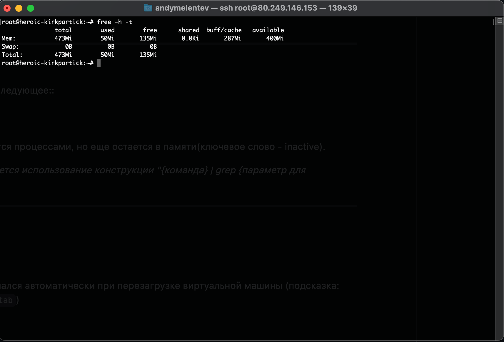
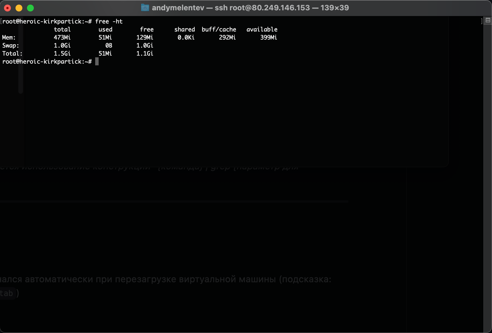
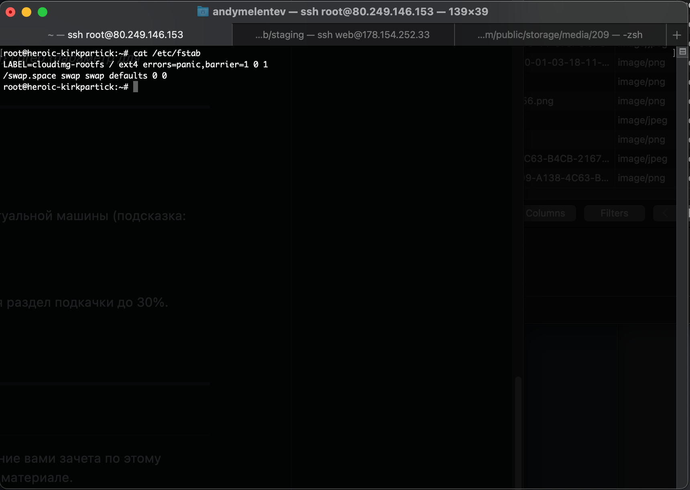
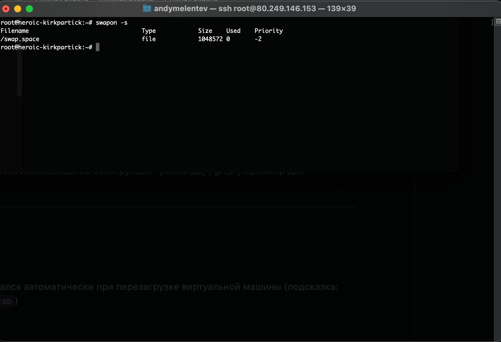
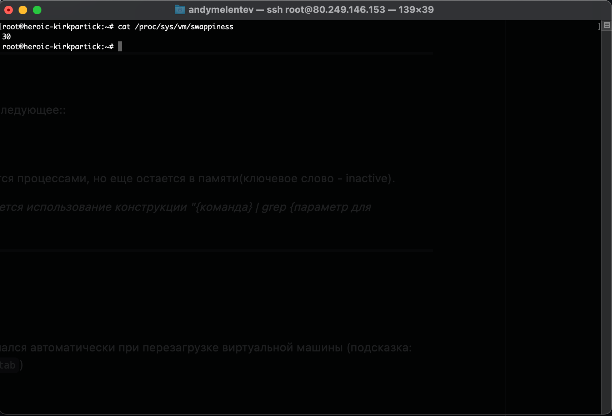
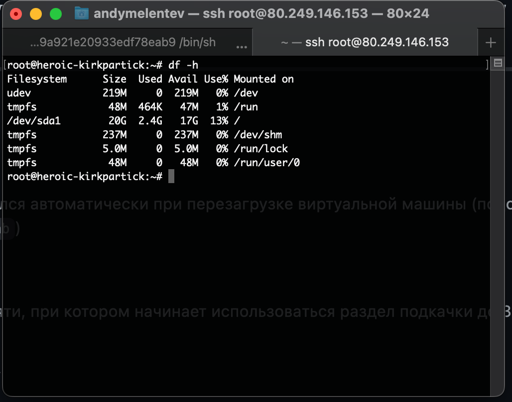
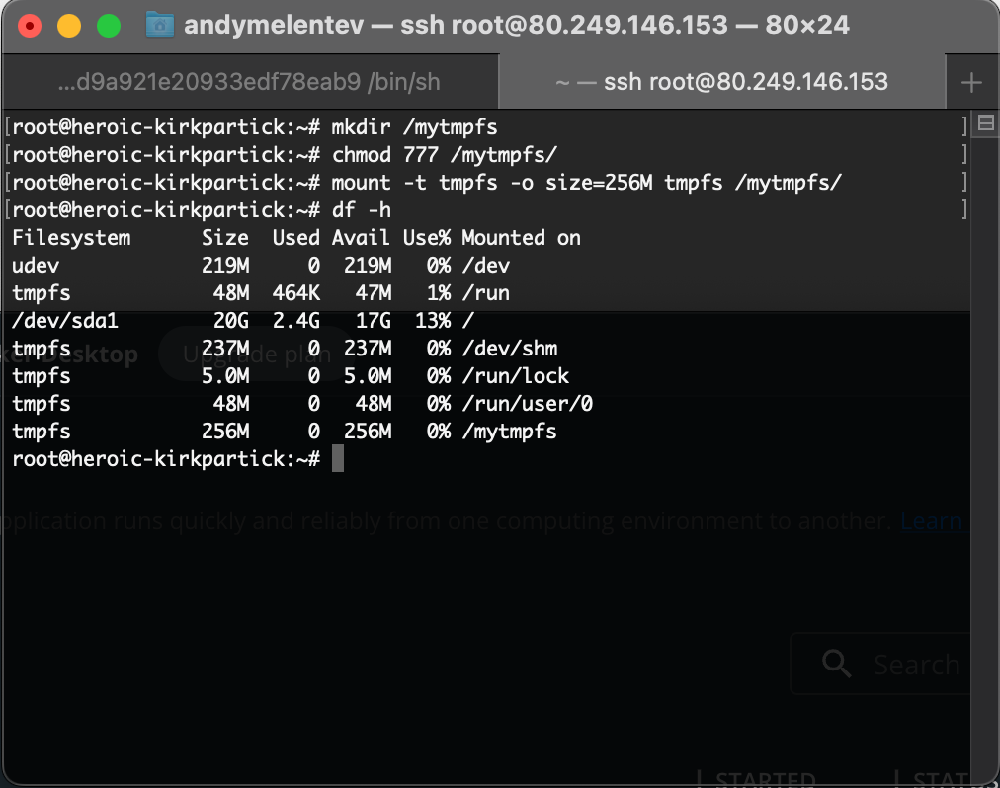

# Домашнее задание по лекции "2.4 Память, управление памятью"

#### [Задание №1](#задание-1-текст-задания)
#### [Задание №2](#задание-2-текст-задания)
#### [Задание №3](#задание-3-текст-задания)
#### [Задание №4](#задание-4-текст-задания)
#### [Задание №5](#задание-5-текст-задания)

### Задание №1 ([Текст Задания](https://github.com/netology-code/slin-homeworks/blob/slin-7/2-04.md#%D0%B7%D0%B0%D0%B4%D0%B0%D0%BD%D0%B8%D0%B5-1))

1. В режиме сна оперативная память остается активной и поддерживает работу всех запущенных программ.
2. В режиме гибернации оперативная память отключается, как и все остальное, а все что в ней было записывается в файл на HDD\SDD.

---

### Задание №2 ([Текст Задания](https://github.com/netology-code/slin-homeworks/blob/slin-7/2-04.md#%D0%B7%D0%B0%D0%B4%D0%B0%D0%BD%D0%B8%D0%B5-2))

Программа называется VmStat


```si - Объем памяти, выгружаемой с диска```

```so - Объем памяти, выгруженной на блочное устройство```

---

### Задание №3 ([Текст Задания](https://github.com/netology-code/slin-homeworks/blob/slin-7/2-04.md#%D0%B7%D0%B0%D0%B4%D0%B0%D0%BD%D0%B8%D0%B5-3))

1. lscpu | grep Architecture 
2. lscpu | grep "Model name" и cat /proc/cpuinfo | grep "model name"
3. cat /proc/meminfo | grep Inactive и vmstat -s | grep inactive

---

### Задание №4 ([Текст Задания](https://github.com/netology-code/slin-homeworks/blob/slin-7/2-04.md#%D0%B7%D0%B0%D0%B4%D0%B0%D0%BD%D0%B8%D0%B5-4))

1. Cкрин вывода команды free -h -t

2. Cкрин вывода команды free -h -t после подключения swap

3. Настройка автоматического подключения swap-файла при перезагрузке виртуальной машины

4. Скрин команды swapon -s

5. Процент свободной оперативной памяти, при котором начинает использоваться раздел подкачки


---

### Задание №5 ([Текст Задания](https://github.com/netology-code/slin-homeworks/blob/slin-7/2-04.md#%D0%B7%D0%B0%D0%B4%D0%B0%D0%BD%D0%B8%D0%B5-5))

Tmpfs — временное файловое хранилище 

Так как основной фишкой этого типа хранения данных является скорость, то думаю что основная цель применения будет 
создания временного кеша. Не исключено использование в работке с большими данными где нужна высокая скорость доступа.
Или еще может пространством для временных пользователей. Короче назначений можно придумать кучу.

До:



После:



---