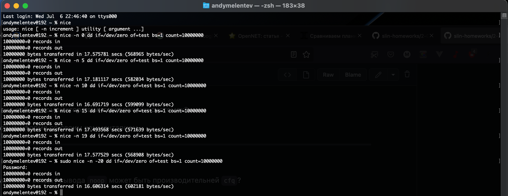
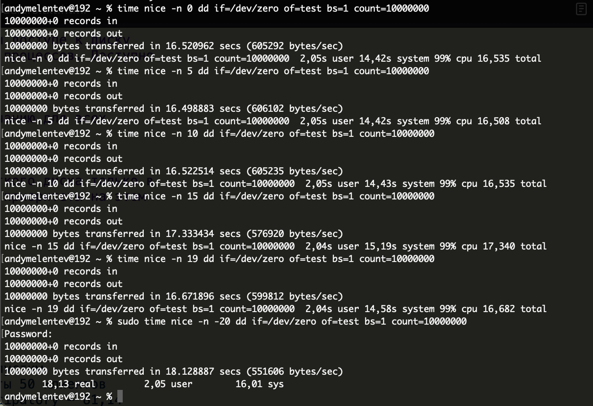

# Домашнее задание по лекции "2.5 Шедулер"

#### [Задание №1](#задание-1-текст-задания)
#### [Задание №2](#задание-2-текст-задания)
#### [Задание №3](#задание-3-текст-задания)
#### [Задание №4](#задание-4-текст-задания)
#### [Задание №5](#задание-5-текст-задания)

### Задание №1 ([Текст Задания](https://github.com/netology-code/slin-homeworks/blob/slin-7/2-05.md#%D0%B7%D0%B0%D0%B4%D0%B0%D0%BD%D0%B8%D0%B5-1))

Если отвечать по существу, то любые. Если отвечать в контексте "Шедулера", то те задачи которые не помещаются в кеш 
процессора и начинают помещаться в оперативную память. Так же сюда можно отнести программы, которые работают с несколькими 
ядрами поочередно (тут важен конечно контекст, но у меня его нет).

---

### Задание №2 ([Текст Задания](https://github.com/netology-code/slin-homeworks/blob/slin-7/2-05.md#%D0%B7%D0%B0%D0%B4%D0%B0%D0%BD%D0%B8%D0%B5-2))

NOOP будет быстрее при выполнении простейших задач с не дисковыми устройствами или решениями которые содержат в себе 
планировщик. Т.е. работает в режиме FIFO (Firs In, First Out).

---

### Задание №3 ([Текст Задания](https://github.com/netology-code/slin-homeworks/blob/slin-7/2-05.md#%D0%B7%D0%B0%D0%B4%D0%B0%D0%BD%D0%B8%D0%B5-3))

Без утилиты time:

С утилитой time:

Если честно, то непонятно о какой разнице во времени мы говорим, может быть дело в том что у меня стоит довольно
мощная конфигурация (MacBook Pro M1 Pro), скорей всего на более слабых конфигурациях разницу будет видно более отчетливо.
Но на моей это больше похоже на погрешность.

В целом если время и будет существенно отличаться то я думаю только потому что на их исполнения выделяется разное 
количество процессорного времени в зависимости от приоритета.

---

### Задание №4 ([Текст Задания](https://github.com/netology-code/slin-homeworks/blob/slin-7/2-05.md#%D0%B7%D0%B0%D0%B4%D0%B0%D0%BD%D0%B8%D0%B5-4))

На практике time slice по сути это время которое мы даем на исполнение задачи (или части задачи). Из этого могу сделать 
предположение, увеличение этого параметра стоит делать только в том случае когда мы точно понимаем, что для исполнения
задачи (или части задачи) нам потребуется больше времени, чем выделено системой по-умолчанию.

---

### Задание №5 ([Текст Задания](https://github.com/netology-code/slin-homeworks/blob/slin-7/2-05.md#%D0%B7%D0%B0%D0%B4%D0%B0%D0%BD%D0%B8%D0%B5-5))

Не смог выполнить просто по тому что не понял как запустить браузер с разными приоритетами в MacOs