# Домашнее задание по лекции "2.6 Дисковые системы"

#### [Задание №1](#задание-1-текст-задания)
#### [Задание №2](#задание-2-текст-задания)
#### [Задание №3](#задание-3-текст-задания)
#### [Задание №4](#задание-4-текст-задания)
#### [Задание №5](#задание-5-текст-задания)

### Задание №1 ([Текст Задания](https://github.com/netology-code/slin-homeworks/blob/slin-7/2-06.md#%D0%B7%D0%B0%D0%B4%D0%B0%D0%BD%D0%B8%D0%B5-1))

В принципе все виды рейд массивов повышают производительность дисковой системы, вопрос стоит только в том что является
измерителем производительности, в некоторых системах это надежность хранения данных, в некоторых скорость чтения\записи.

Но если все таки рассматривать в привычном понимании слова производительность = скорость чтения\записи данных, то я 
полагаю что лидерами буду следующие. 

```
Raid 0

+ Высокая скорость чтения \ записи
+ Диски используються по максимуму

- Низкая надежность
```

```
Raid 1

+ Высокая степень надежности
+ Высокая скорость чтения

- Низкая эффективность использования дискового пространства
- Незначительное снижение скорости записи

```

```
Raid 10

+ Высокая скорость чтения и записи
+ Повышенная надежность

- Эффективность использования дискового пространства 50%

```

```
Raid 50

+ Значительное повышение скорости чтения
+ Высокая эффективность использования дискового пространства

- Незначительное снижение скорости записи
- Недостаточная надежность для коммерческого использования

```

```
Raid DP

+ Высокая скорость чтения
+ Высокая скорость записи
+ Высокая степень надежности 

- Низкая эффективность использования дискового пространства

```
Хотя если честно это почти все. Тут конечно не хватает RAID 3,4,5,6,60,TEC, но их тут нет по причине того что их
производительность значительно уступает в некоторых аспектах перечисленным мной выше.

---

### Задание №2 ([Текст Задания](https://github.com/netology-code/slin-homeworks/blob/slin-7/2-06.md#%D0%B7%D0%B0%D0%B4%D0%B0%D0%BD%D0%B8%D0%B5-2))

В целом повлиять на значение могут, но реальной картины все равно не отражает реальной картины нагрузки, такое происходит
например при использовании медленных СХД или ошибок NFS (Network File System).

---

### Задание №3 ([Текст Задания](https://github.com/netology-code/slin-homeworks/blob/slin-7/2-06.md#%D0%B7%D0%B0%D0%B4%D0%B0%D0%BD%D0%B8%D0%B5-3))

GPT:
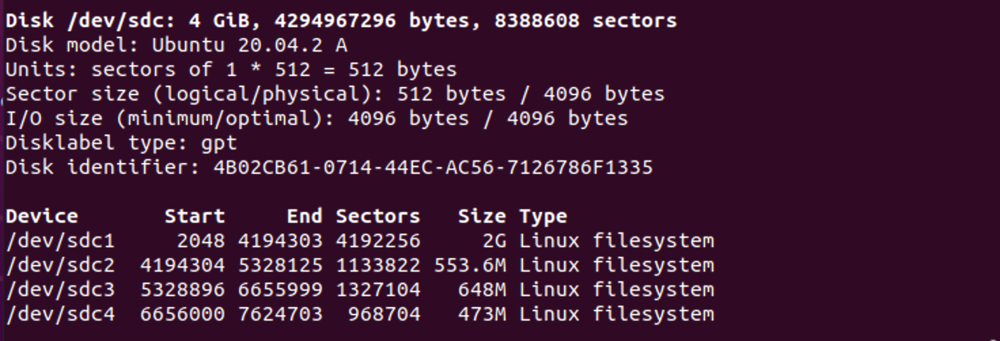

MBR:
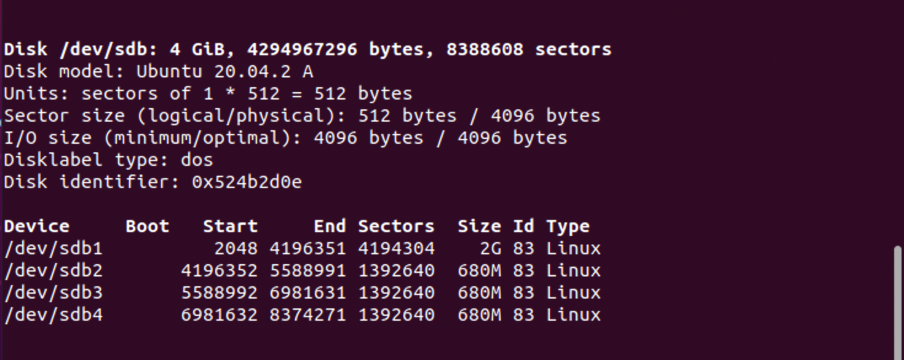

---

### Задание №4 ([Текст Задания](https://github.com/netology-code/slin-homeworks/blob/slin-7/2-06.md#%D0%B7%D0%B0%D0%B4%D0%B0%D0%BD%D0%B8%D0%B5-4))

```bash 
mdadm -D /dev/md0
```
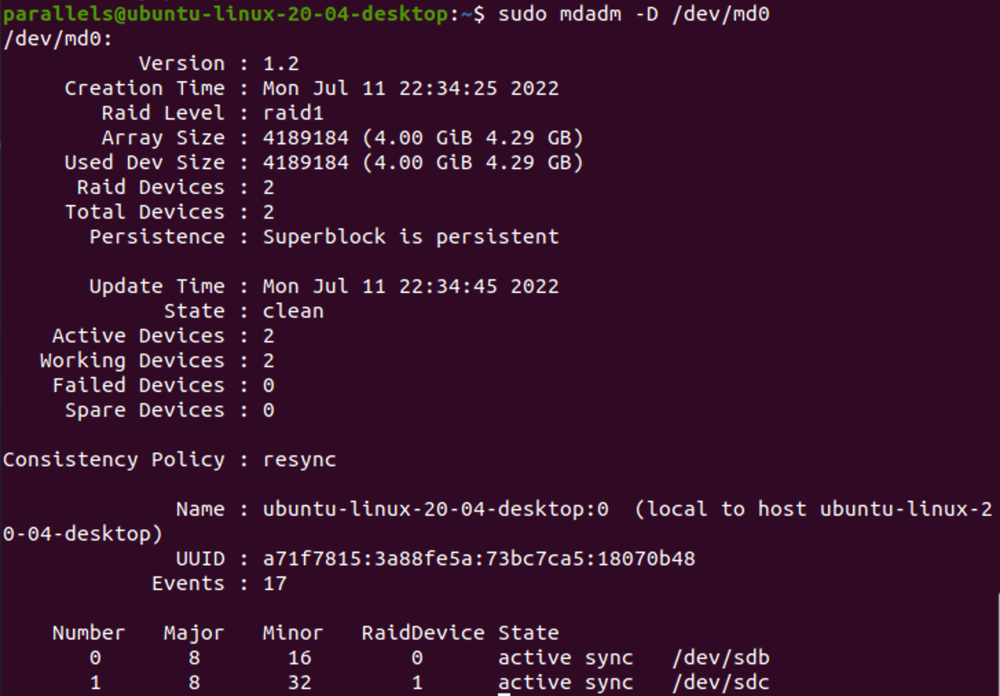

---

### Задание №5 ([Текст Задания](https://github.com/netology-code/slin-homeworks/blob/slin-7/2-06.md#%D0%B7%D0%B0%D0%B4%D0%B0%D0%BD%D0%B8%D0%B5-5))
 
1. Сделайте скриншоты вывода команд df -h, pvs, lvs, vgs;
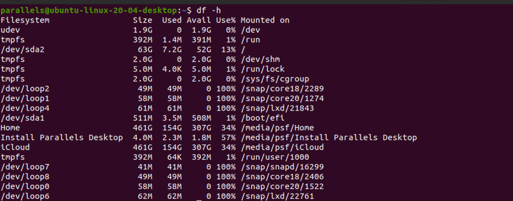

2. подключите к ОС 2 новых диска;
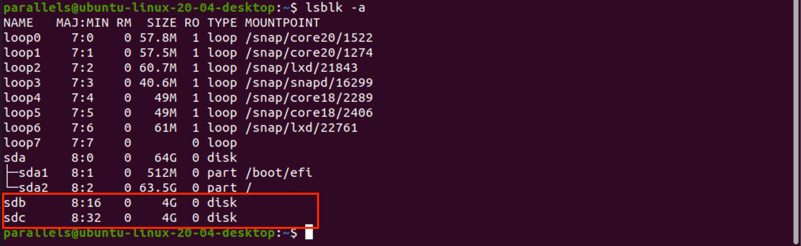
3. создайте новую VG, добавьте в него 1 диск;
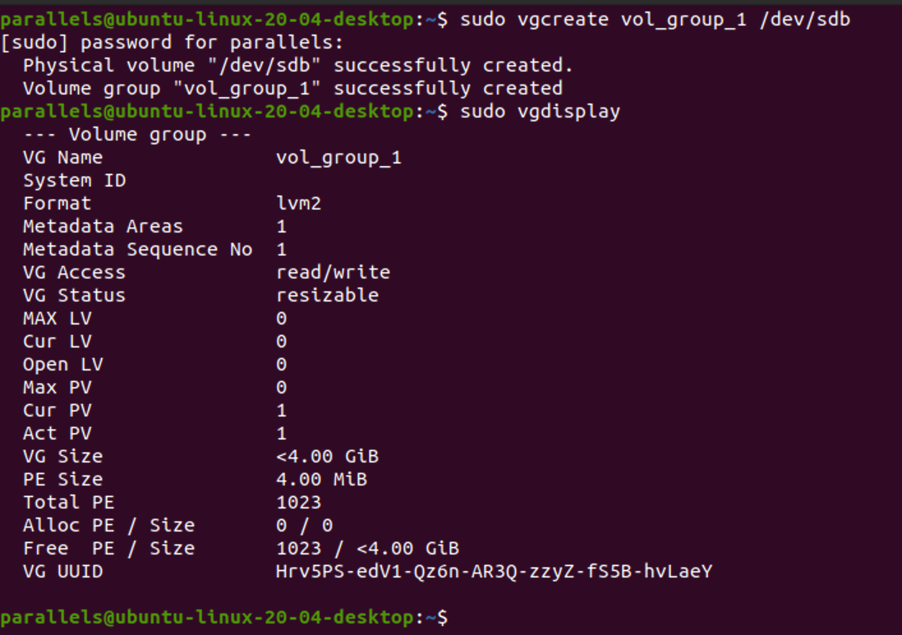
4. создайте 2 LV, распределите доступное пространство между ними поровну;
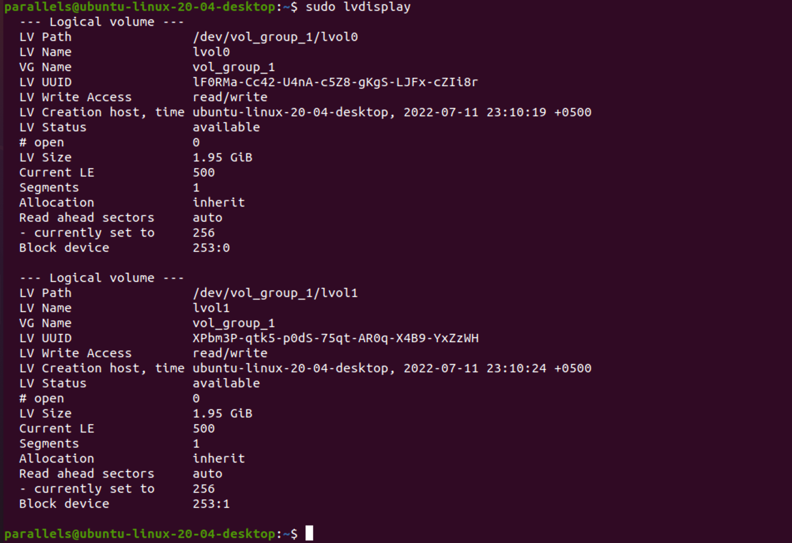
5. создайте на обоих томах файловую систему `xfs`;
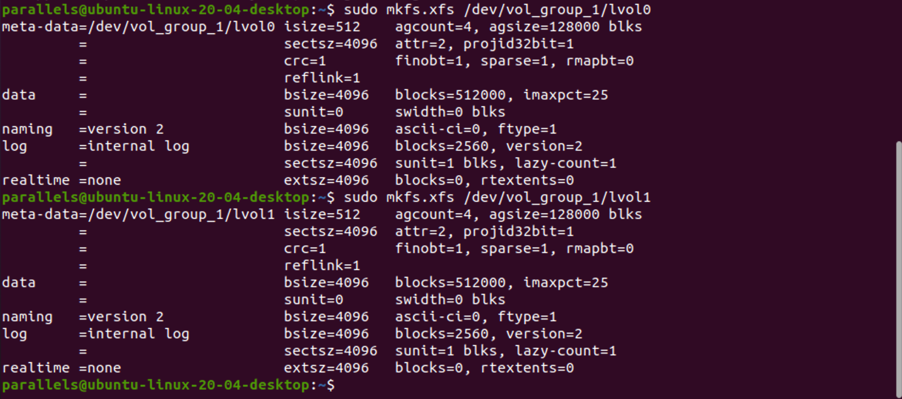
6. создайте две точки монтирования и смонтируйте каждый из томов;
7. сделайте скриншот вывода команд df -h;
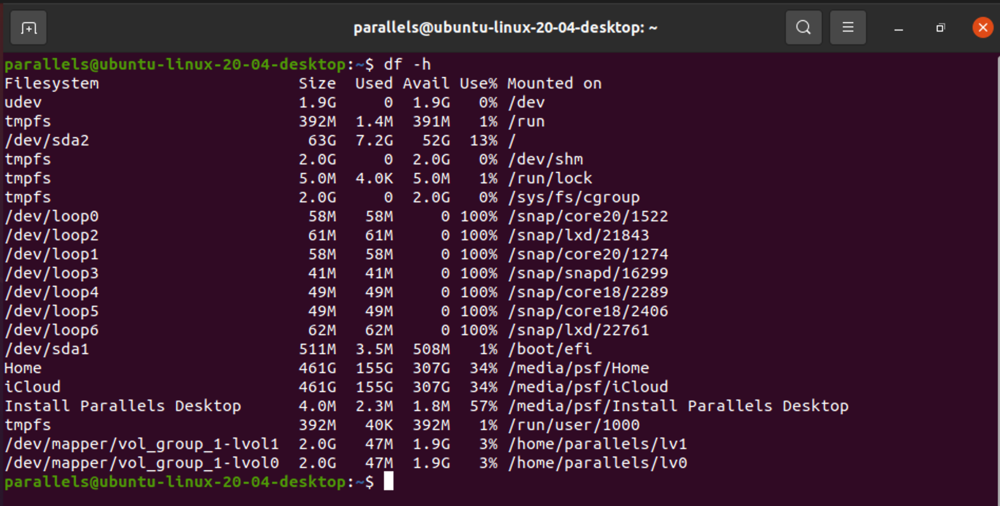
8. добавьте в VG второй оставшийся диск;
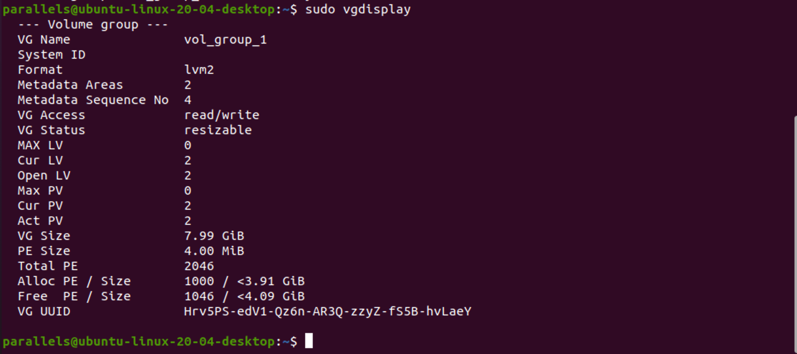
9. расширьте первый LV на объем нового диска;
10. расширьте файловую систему на размер нового доступного пространства;
11. сделайте скриншоты вывода команд df -h, pvs, lvs, vgs.
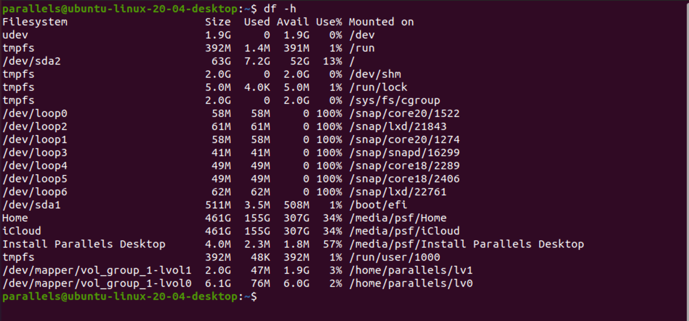
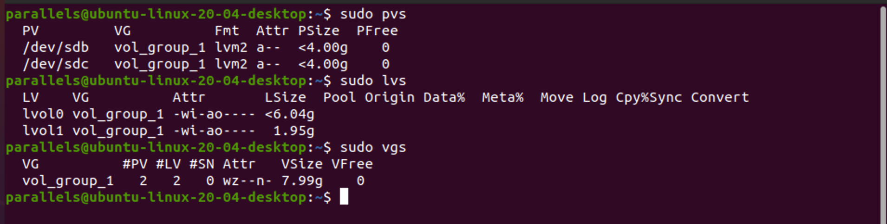