# Домашнее задание по лекции "2.7 Файловые системы"

#### [Задание №1](#задание-1-текст-задания)
#### [Задание №2](#задание-2-текст-задания)
#### [Задание №3](#задание-3-текст-задания)
#### [Задание №4](#задание-4-текст-задания)
#### [Задание №5](#задание-5-текст-задания)

### Задание №1 ([Текст Задания](https://github.com/netology-code/slin-homeworks/blob/slin-7/2-07.md#%D0%B7%D0%B0%D0%B4%D0%B0%D0%BD%D0%B8%D0%B5-1))
Скриншоты подготовительных этапов:
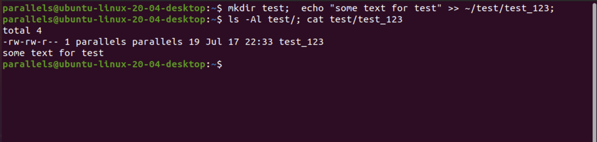
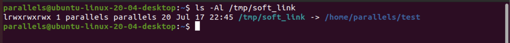
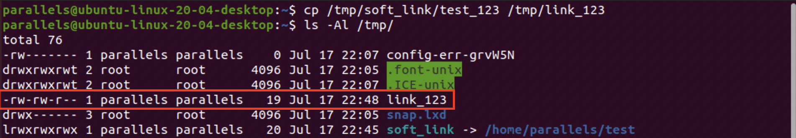
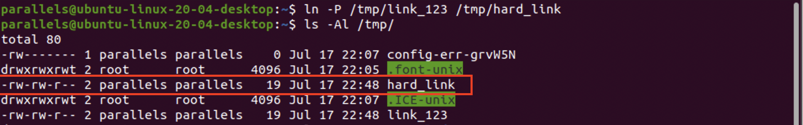

**Вопрос 1: Файл ~/test и /tmp/test_123 это один и тот же файл(одинаковые inode)?**

Нет конечно. Хотя бы потому что первый это папка, а второй это данные.
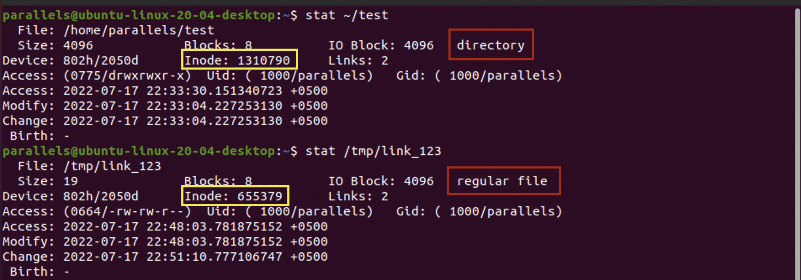

**Вопрос 2: Файл /tmp/soft_link и /tmp/hard_link это один и тот же файл(одинаковые inode)?**

Да это же то же самое что и первый вопрос. Нет первое это символическая ссылка на каталог,
а второе это жесткая ссылка на файл.
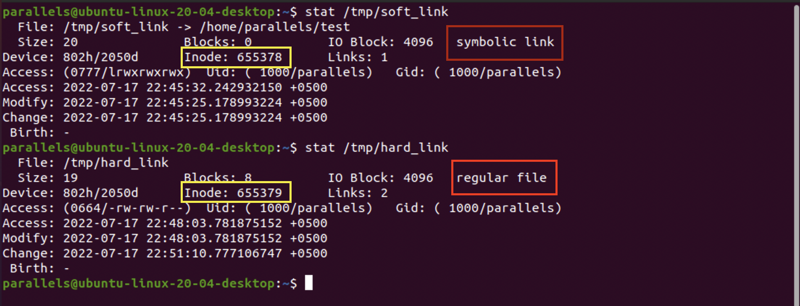

**Вопрос 3: Файл /tmp/test_123 и /tmp/hard_link это один и тот же файл(одинаковые inode)?**

А вот тут я отвечу что да, судя по тому что я услышал на лекции hardlink это по факту 
второе имя файла, так как hardlink указывает на туже область памяти.
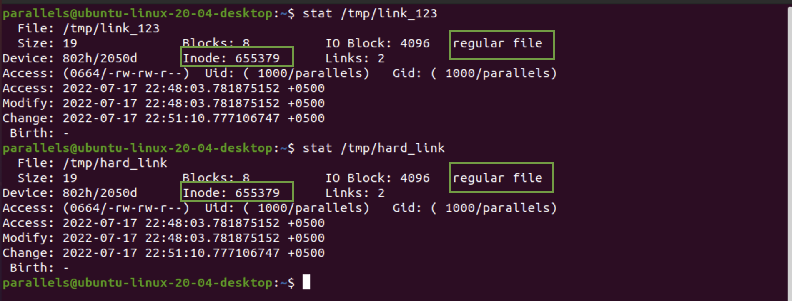

**Вопрос 4: Докажите что одна из ссылок символическая, а другая жесткая. 
Обязательно приложите в ответ скриншоты команд, которые иллюстрируют различия ссылок 
разного типа или(если не уверены) ход решения задания.**

В принципе на изображении все и так будет понятно, выше в ответах на вопросы можно увидеть
что символьная ссылка так и помечается если смотреть через утилиту `stat`. 
Но кроме всего этого у них разниться даже сам принцип работы символьная ссылка это просто альтернативный путь до 
файла\папки. А жесткая ссылка это по факту второе название исходного блока памяти на который она ссылается.
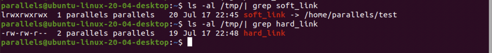

---

### Задание №2 ([Текст Задания](https://github.com/netology-code/slin-homeworks/blob/slin-7/2-07.md#%D0%B7%D0%B0%D0%B4%D0%B0%D0%BD%D0%B8%D0%B5-2))

Все будет сломано уже на втором шаге (получим ошибку существования файла).
Так как в линукс системах все является файлом, то при создании файла "папки" у нас получиться 
конфликт имен
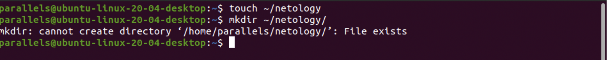
---

### Задание №3 ([Текст Задания](https://github.com/netology-code/slin-homeworks/blob/slin-7/2-07.md#%D0%B7%D0%B0%D0%B4%D0%B0%D0%BD%D0%B8%D0%B5-3))

1. `sudo df -ih /` - покажет статистику по inode (всего, использовано, свободно, используется %)
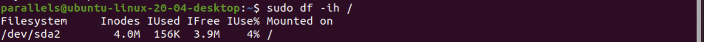
2. Я думаю что тут единственный ответ будет `btrfs` и ее все возможные конфигурации, так как
эта файловая система сама динамически создает inodes, то чисто теоретически они бесконечны, 
а значит и проблем с их нехваткой нет.

---

### Задание №4 ([Текст Задания](https://github.com/netology-code/slin-homeworks/blob/slin-7/2-07.md#%D0%B7%D0%B0%D0%B4%D0%B0%D0%BD%D0%B8%D0%B5-4))

Тут немного промахнулся с размерами, потерял 200мб. Думаю не критично, главное понял что
"Parted" всему голова.

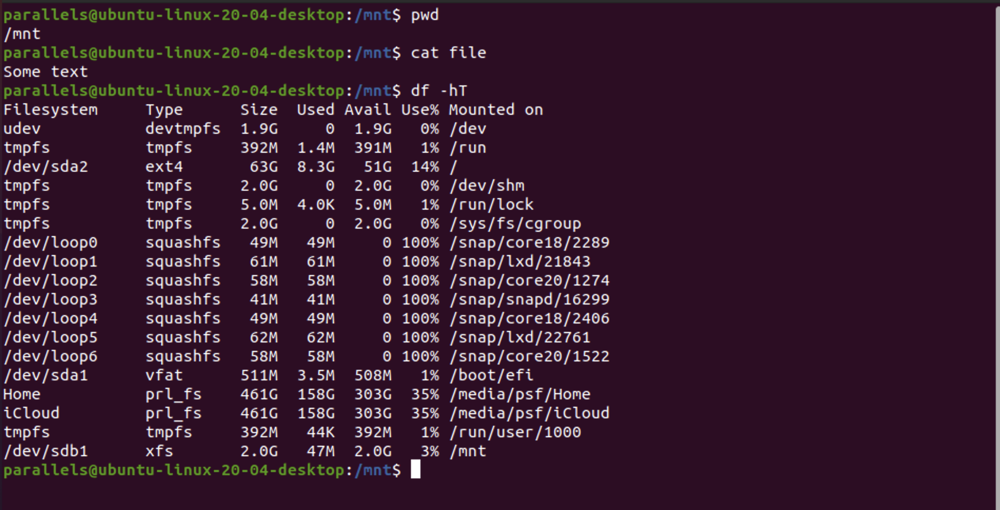
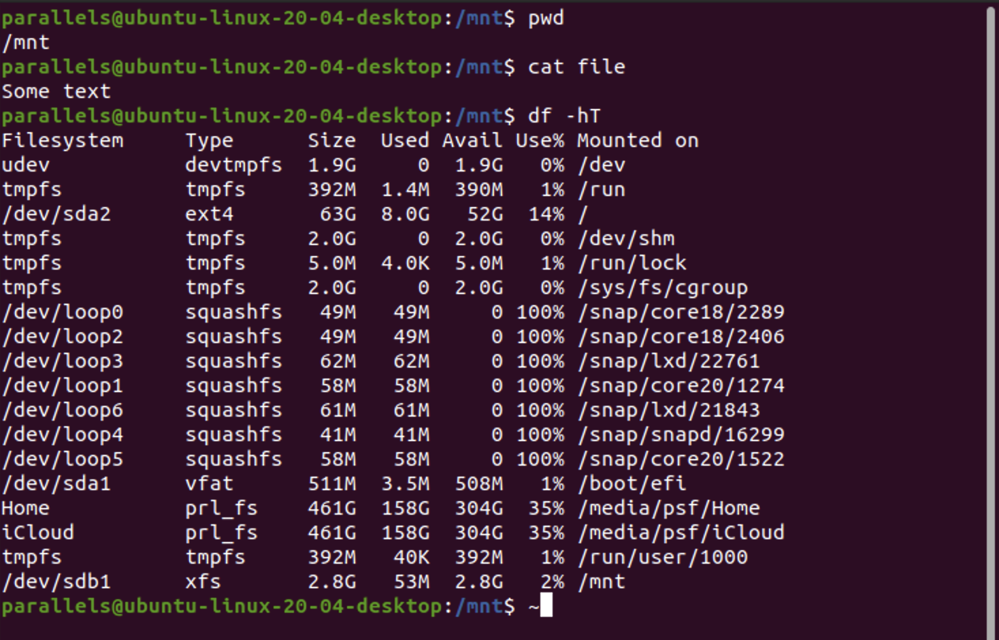

---

### Задание №5 ([Текст Задания](https://github.com/netology-code/slin-homeworks/blob/slin-7/2-07.md#%D0%B7%D0%B0%D0%B4%D0%B0%D0%BD%D0%B8%D0%B5-5))

Это я попробовал создать их в рейде, не уверен, что верное решение. Но данные про размер метаданных, 
и свободного пространства тут присутствуют.
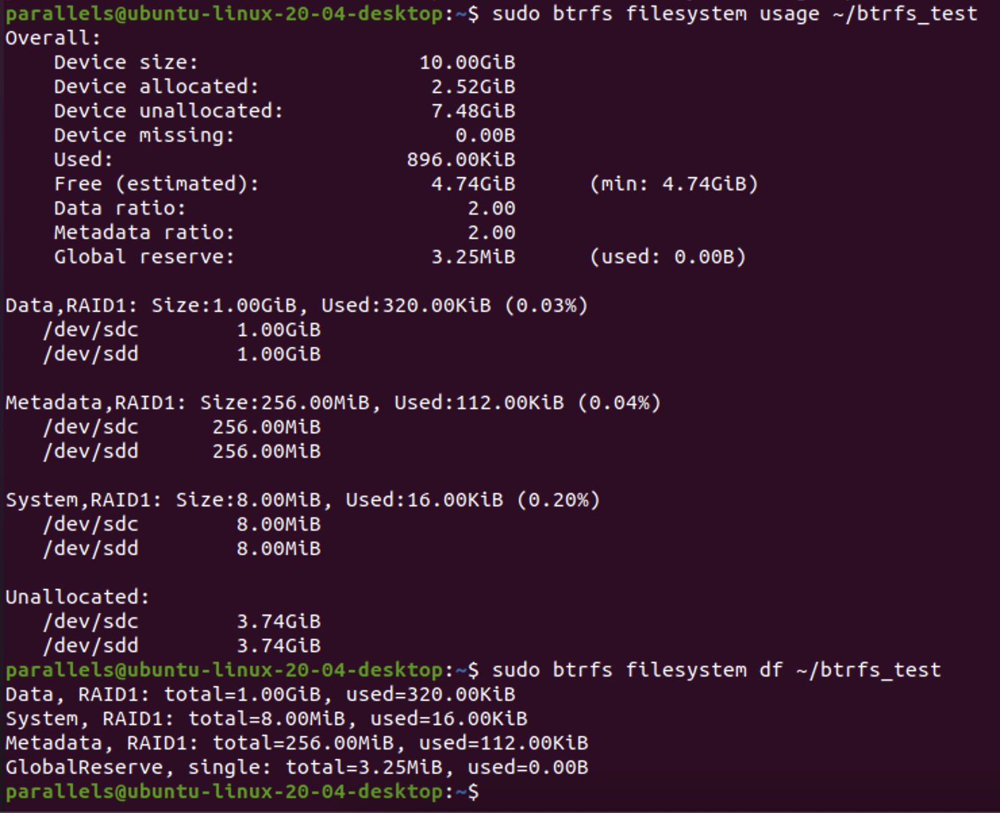