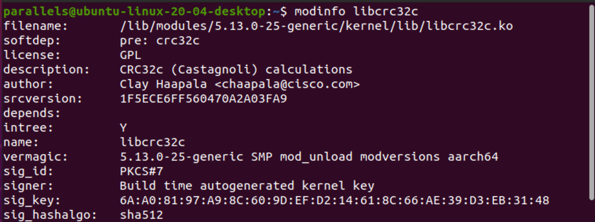

# Домашнее задание по лекции "2.8 Ядро операционной системы"

#### [Задание №1](#задание-1-текст-задания)
#### [Задание №2](#задание-2-текст-задания)
#### [Задание №3](#задание-3-текст-задания)
#### [Задание №4](#задание-4-текст-задания)
#### [Задание №5](#задание-5-текст-задания)

### Задание №1 ([Текст Задания](https://github.com/netology-code/slin-homeworks/blob/slin-7/2-08.md#%D0%B7%D0%B0%D0%B4%D0%B0%D0%BD%D0%B8%D0%B5-1))

В двух из трех ситуациях точно вызывается ядро, третий вариант это по сути смоделированная заранее ситуация и там вызов
ядра может быть не обязательным.

- Аппаратные прерывания
- Системные вызовы
- Особые ситуации (частные случаи)

---

### Задание №2 ([Текст Задания](https://github.com/netology-code/slin-homeworks/blob/slin-7/2-08.md#%D0%B7%D0%B0%D0%B4%D0%B0%D0%BD%D0%B8%D0%B5-2))

---

### Задание №3 ([Текст Задания](https://github.com/netology-code/slin-homeworks/blob/slin-7/2-08.md#%D0%B7%D0%B0%D0%B4%D0%B0%D0%BD%D0%B8%D0%B5-3))

### [StraceLog](assets/logs/hw-10/trace.log)

Немного не понятно какой именно из системных вызовов вам нужен так что приложу [лог](assets/logs/hw-10/trace.log) на 
всякий случай (еще одна ссылка в начале ответа), а в качестве ответа пускай будет самый первый системный вызов.

`execve("/usr/bin/bash", ["bash", "-c", "cd /tmp"], 0xffffcd245bf0 /* 49 vars */) = 0`

---

### Задание №4 ([Текст Задания](https://github.com/netology-code/slin-homeworks/blob/slin-7/2-08.md#%D0%B7%D0%B0%D0%B4%D0%B0%D0%BD%D0%B8%D0%B5-4))

На всякий случай прикладываю еще файл лога [DmesgLog](assets/logs/hw-10/dmesg.log)

