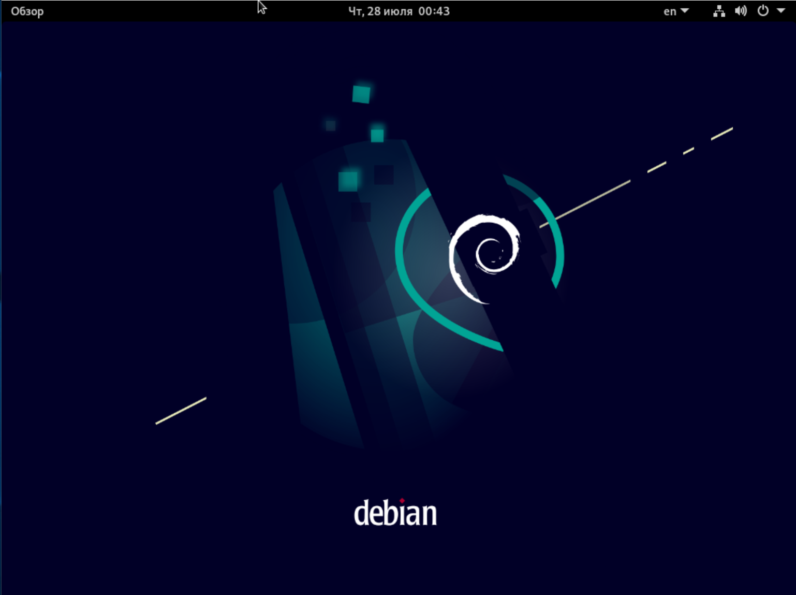

# Домашнее задание по лекции "3.1 Типы дистрибутивов Linux"

#### [Задание №1](#задание-1-текст-задания)
#### [Задание №2](#задание-2-текст-задания)
#### [Задание №3](#задание-3-текст-задания)

### Задание №1 ([Текст Задания](https://github.com/netology-code/slin-homeworks/blob/slin-7/3-01.md#%D0%B7%D0%B0%D0%B4%D0%B0%D0%BD%D0%B8%D0%B5-1))

Дистрибутив – это форма распространения системного программного обеспечения. По факту это пред настроенная сборка ОС,
содержащая в себе все необходимое для работы ОС (драйвера, графическая оболочка, базовое программное обеспечение).

Что входит если говорить о базовых вещах, то это ядро, системные программы, драйвера, графический интерфейс, различное 
стороннее ПО как открытое, так и открытое.

---

### Задание №2 ([Текст Задания](https://github.com/netology-code/slin-homeworks/blob/slin-7/3-01.md#%D0%B7%D0%B0%D0%B4%D0%B0%D0%BD%D0%B8%D0%B5-2))

По сути **_Таненбаум_** сделал то что нужно было для развития разработки операционных систем, он учил людей это делать.
Он создал некий учебный проект (Minix) и на основе него начал объяснять студентам и не только им я думаю, как работает
операционная система. А так как его учебное пособие было еще и с открытым исходным кодом, это позволяло буквально 
проанализировать как работает ОС в живую.

И к чему это привело? Да буквально к взрывному росту количества разработчиков ОС. (Очень похожая ситуация с 
Python разработчиками когда разработке начали учить на каждом углу)

---

### Задание №3 ([Текст Задания](https://github.com/netology-code/slin-homeworks/blob/slin-7/3-01.md#%D0%B7%D0%B0%D0%B4%D0%B0%D0%BD%D0%B8%D0%B5-3))

3.1 _Как получить информацию из какого репозитория был установлен пакет?_

Fedora - `yum info mc | grep Repository`

Debian - `apt info mc | APT-Sources` или `apt-cache policy mc`

---

3.2 _Какой командой можно получить список доступных репозиториев в RPM и Deb- based системах? Два ответа для каждой из систем._

Fedora - `yum repolist`

Debian - `cat /etc/apt/source.list`

---

3.3 _Как узнать версию ОС в Linux? Как узнать версию ядра? Укажите для вашей системы, неважно какой._

`cat /proc/version` или `uname –r` - версия ядра

`cat /etc/*release` - версия дистрибутива

---

3.4 _Как узнать какая система инициализации используется в Linux? Укажите для вашей системы, неважно какой._

`systemctl --version | head -n1`

---

3.5

Gnome Debian

Xfce Debian

