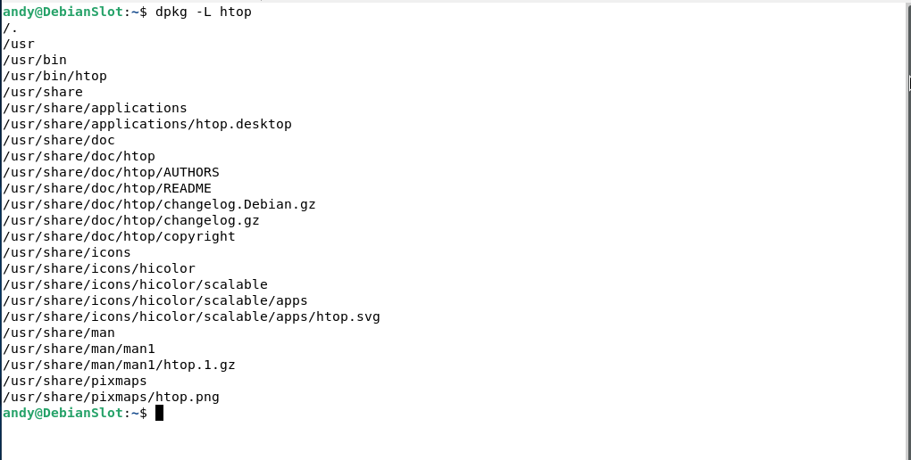
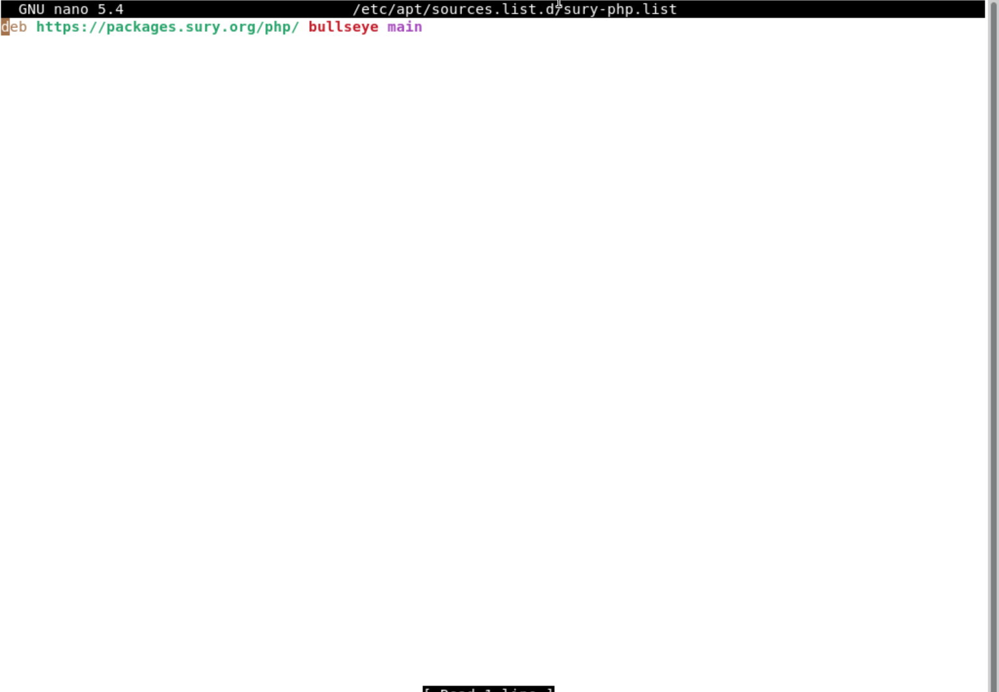
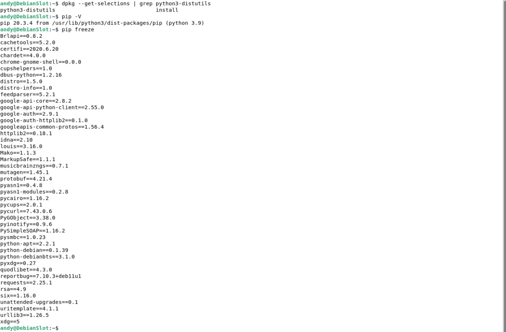
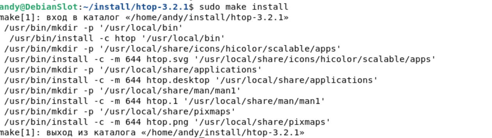
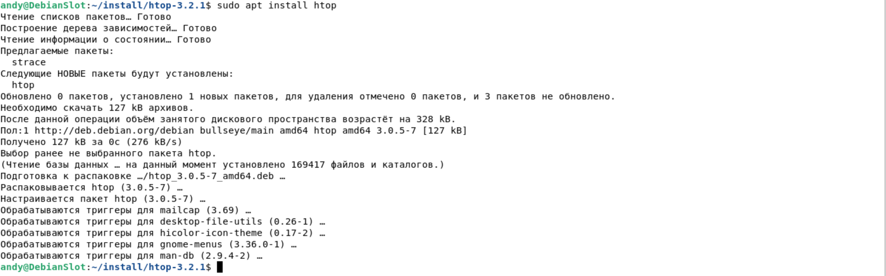

# Домашнее задание по лекции "3.2 Управление пакетами"

#### [Задание №1](#задание-1-текст-задания)
#### [Задание №2](#задание-2-текст-задания)
#### [Задание №3](#задание-3-текст-задания)
#### [Задание №4](#задание-3-текст-задания)
#### [Задание №5](#задание-3-текст-задания)
#### [Задание №6](#задание-3-текст-задания)
#### [Задание №7](#задание-3-текст-задания)

### Задание №1 ([Текст Задания](https://github.com/netology-code/slin-homeworks/blob/slin-7/3-02.md#%D0%BA%D0%B5%D0%B9%D1%81-1))

Ну если описывать плюсы, то по сути сам подход это один большой и жирный плюс. Если вдаваться в конкретику, то:
+ Основной плюс это то что большинство ПО храниться централизованно
+ Все ПО уже само знает куда установиться, где разместить конфиги, что подтянуть в качестве зависимостей
+ Если вам нужно установить коллекцию разных пакетов есть мета пакеты (условный Lamp наверно под это подходит)
+ Большинство ПО прошло какую-то проверку и поэтому можно считать его условно безопасным

Из минусов:
+ Не все ПО есть в дефолтных репозиториях, а значит придется ручками подключать сторонние
+ Большинство ПО прошло какую-то проверку, но не все поэтому надо более внимательным при его выборе из сторонних репозиториев
+ Иногда ПО вообще нет в репозиториях и тогда придется качать исходники и собирать программу ручками

В остальном мне как заядлому пользователь MacOS в принципе подход с репозиториями и пакетами очень нравиться. Хотя бы 
по тому что я точно куда установиться программа, и где мне искать ее конфигурацию если она есть по умолчанию. Ну а Brew 
это вообще сказка, опять же в рамках моей постоянной системы.

---

### Задание №2 ([Текст Задания](https://github.com/netology-code/slin-homeworks/blob/slin-7/3-02.md#%D0%BA%D0%B5%D0%B9%D1%81-2))

Чтобы добавить сторонний репозиторий нам понадобиться:
+ Установить по необходимое для работы `apt-transport-https`, `lsb-release`, `ca-certificates`
+ Скачать GPG-ключ (пример из презентации `sudo wget -O /etc/apt/trusted.gpg.d/php.gpg https://packages.sury.org/php/apt.gpg`)
+ добавить его в source.list файл (пример из презентации `sudo sh -c 'echo "deb https://packages.sury.org/php/ $(lsb_release -sc) 
main" > /etc/apt/sources.list.d/php.list'`)
+ Выполнить команды update и upgrade, чтобы подтянуть информацию о репозитории.
+ И наконец установить необходимый пакет с помощью пакетного менеджера `apt install {packegeName}` или `yum instll {packegeName}`

Основная опасность такого распространения, как мне кажется это безопасность. Не всегда разработчики, которым принадлежит 
репозиторий и ПО, являются по-умолчанию добросовестными и могут попытаться протащить вредоносный код к вам в систему.

Основное что нужно делать:
1. Тщательно выбирать поставщика ПО (репозиторий)
2. Тестировать пакет в изолированной среде, чтобы он в случае чего не смог повлиять на вашу систему

---

### Задание №3 ([Текст Задания](https://github.com/netology-code/slin-homeworks/blob/slin-7/3-02.md#%D0%BA%D0%B5%D0%B9%D1%81-3))

Команда для поиска и установки htop: `apt search htop && sudo apt install htop`

Команда вывода информации о пакете (там можно посмотреть зависимости): `apt show htop`

Зависимости необходимые для установки htop:
+ `libc6 (>=2.29)`
+ `libncursesw6 (>= 6)`
+ `libnl-3-200 (>= 3.2.7)`
+ `libnl-genl-3-200 (>= 3.2.7)`
+ `libtinfo6 (>=6)`

Список всех фалов пакета:

---

### Задание №4 ([Текст Задания](https://github.com/netology-code/slin-homeworks/blob/slin-7/3-02.md#%D0%BA%D0%B5%D0%B9%D1%81-4))

Приложите скриншот содержимого файла, в котором записан адрес репозитория.

Приложите к ответу скриншот версии.

---

### Задание №5 ([Текст Задания](https://github.com/netology-code/slin-homeworks/blob/slin-7/3-02.md#%D0%BA%D0%B5%D0%B9%D1%81-5))

Приложите скриншоты с установленным пакетом python-distutils, с версией Pip и установленными модулями (должны быть видимы)

---

### Задание №6 ([Текст Задания](https://github.com/netology-code/slin-homeworks/blob/slin-7/3-02.md#%D0%BA%D0%B5%D0%B9%D1%81-6))

На самом деле их вагон и маленькая тележка, у почти каждого ЯП есть свой пакетник, то же самое с дистрибутивами Linux\Unix
и конечно же Windows

+ NuGet (C#)
+ Composer (PHP)
+ Brew (MacOs)
+ PacMan (Arch)
+ Zapper (OpenSuse)
+ Portage (Gentoo)
+ Snap (Canonical)
+ FlatPack (Fedora)
+ WinGet (Windows)

---

### Задание №7 ([Текст Задания](https://github.com/netology-code/slin-homeworks/blob/slin-7/3-02.md#%D0%BA%D0%B5%D0%B9%D1%81-7))

Очевидная разница в версиях из пакетного менеджера мы получили htop v.3.0.5, а из исходников я собрал версию 3.2.1

Не понял что нужно было конкретно показать, вот вывод `make install`

Ну и собственно мы выше уже устанавливали htop: `sudo apt install htop`

---
