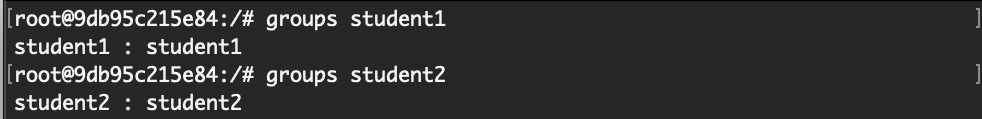
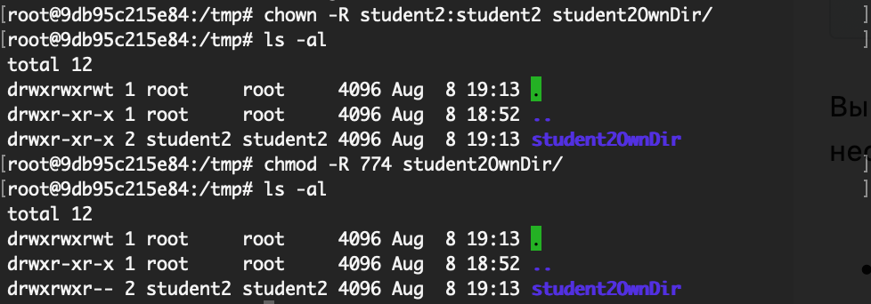
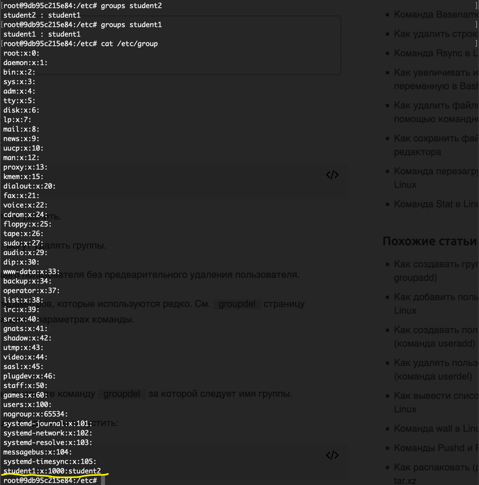

# Домашнее задание по лекции "3.4 Управление пользователями"

#### [Задание №1](#задание-1-текст-задания)
#### [Задание №2](#задание-2-текст-задания)
#### [Задание №3](#задание-3-текст-задания)
#### [Задание №4](#задание-3-текст-задания)

### Задание №1 ([Текст Задания](https://github.com/netology-code/slin-homeworks/blob/slin-7/3-04.md#%D0%B7%D0%B0%D0%B4%D0%B0%D0%BD%D0%B8%D0%B5-1))

Команды для создания пользователей/групп

`useradd -s /usr/bin/bash student1`
`useradd student2`

По хорошему нужно было еще использовать флаг `-p` для того чтобы задать пароль, но так как я работаю в докере смысла в 
этом мало

На скриншоте проверял в каких группах состоят пользователи

---

### Задание №2 ([Текст Задания](https://github.com/netology-code/slin-homeworks/blob/slin-7/3-04.md#%D0%B7%D0%B0%D0%B4%D0%B0%D0%BD%D0%B8%D0%B5-2))

---

### Задание №3 ([Текст Задания](https://github.com/netology-code/slin-homeworks/blob/slin-7/3-04.md#%D0%B7%D0%B0%D0%B4%D0%B0%D0%BD%D0%B8%D0%B5-3))

`/etc/passwd` - `- rw- r-- r--` - содержит базовую информацию о пользователях и доступен для чтения всем:
* регистрационное имя 
* заполнитель пароля 
* идентификатор пользователя 
* идентификатор группы
* поле персональных данных 
* домашний каталог
* командный интерпретатор

`/etc/shadow` - `- rw- r-- ---` - содержит чуть более детальную информацию о пользователях доступен он только `root` 
пользователю:

* Регистрационное имя
* Зашифрованный пароль
* Дата последнего изменения пароля
* Минимальное число дней между изменениями пароля
* Максимальное число дней между изменениями пароля
* Количество дней по истечении срока действия пароля
* Срок действия учетной записи

Эти два файла связанны между собой по полю регистрационного имени пользователя.

---

### Задание №4 ([Текст Задания](https://github.com/netology-code/slin-homeworks/blob/slin-7/3-04.md#%D0%B7%D0%B0%D0%B4%D0%B0%D0%BD%D0%B8%D0%B5-4))

---

