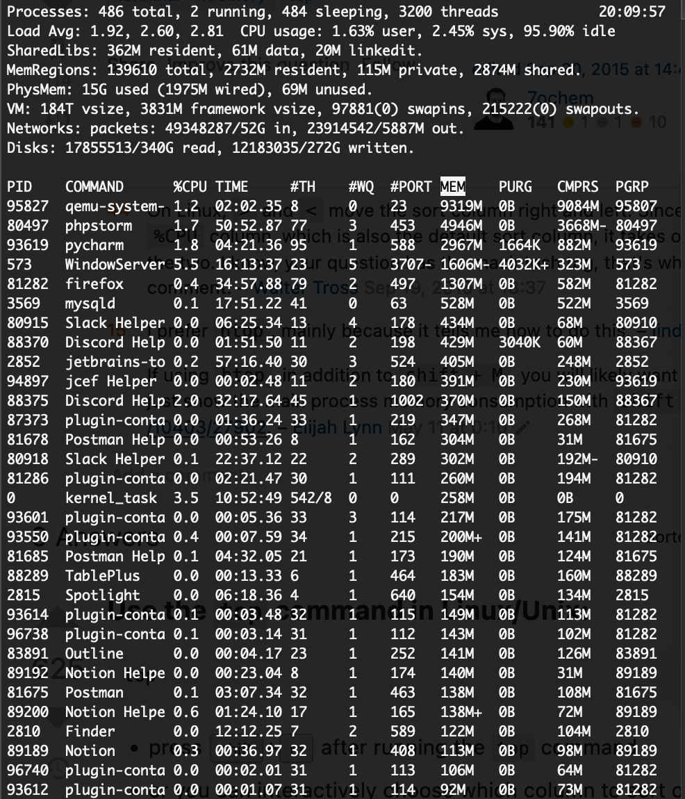

# Домашнее задание по лекции "3.5 Производительность системы"

#### [Задание №1](#задание-1-текст-задания)
#### [Задание №2](#задание-2-текст-задания)
#### [Задание №3](#задание-3-текст-задания)
#### [Задание №4](#задание-4-текст-задания)

### Задание №1 ([Текст Задания](https://github.com/netology-code/slin-homeworks/blob/slin-7/3-05.md#%D0%B7%D0%B0%D0%B4%D0%B0%D0%BD%D0%B8%D0%B5-1))

Не совсем уверен насчет последнего, но в остальном вполне.
Сортировка проводилась через меню (Shift + F).
Но никто не мешает это делать через консоль во время запуска программы например `top -o MEM`

Sort By MEM

Sort By TIME

Sort By PID

Sort By RES

---

### Задание №2 ([Текст Задания](https://github.com/netology-code/slin-homeworks/blob/slin-7/3-05.md#%D0%B7%D0%B0%D0%B4%D0%B0%D0%BD%D0%B8%D0%B5-2))

`atop -acd`

`atopsar -d 60 10`

`atopsar -m 60 10`

---

### Задание №3 ([Текст Задания](https://github.com/netology-code/slin-homeworks/blob/slin-7/3-05.md#%D0%B7%D0%B0%D0%B4%D0%B0%D0%BD%D0%B8%D0%B5-3))

`mpstat -P 1`

`mpstat -P ALL`

---

### Задание №4 ([Текст Задания](https://github.com/netology-code/slin-homeworks/blob/slin-7/3-05.md#%D0%B7%D0%B0%D0%B4%D0%B0%D0%BD%D0%B8%D0%B5-4))

`pidstat -t -G top`

`pidstat -G top -l`

---

