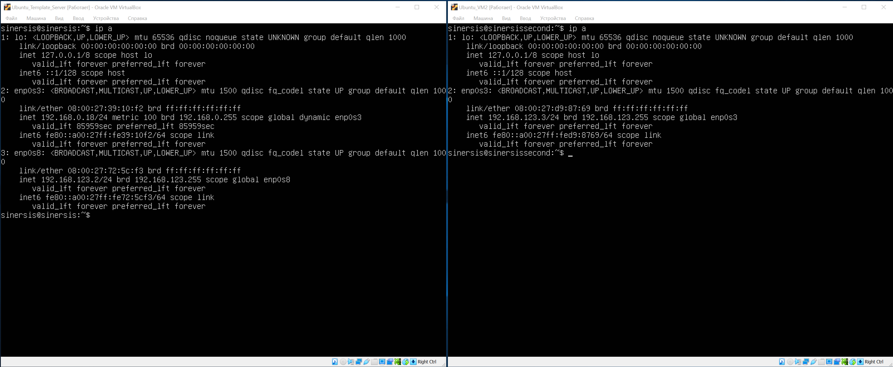
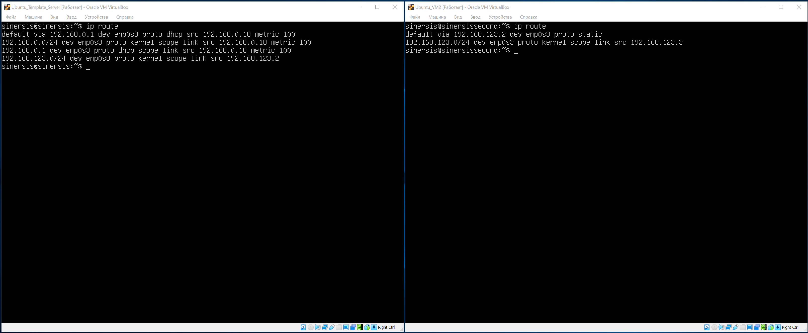
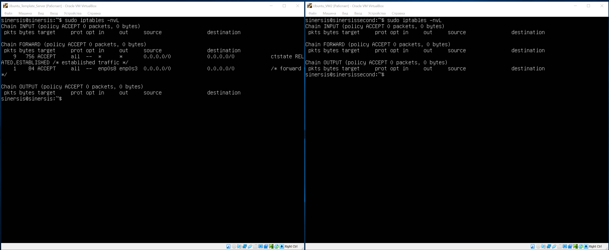
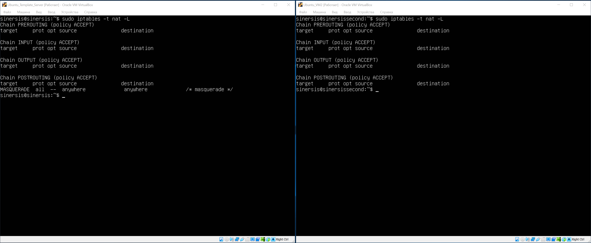
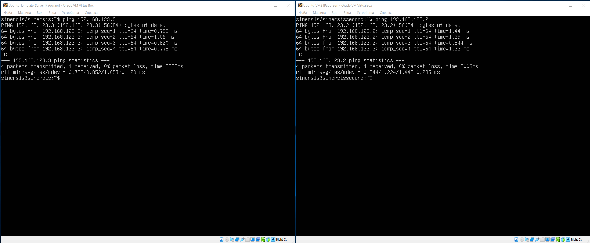
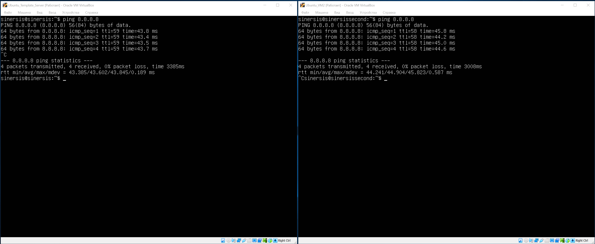

# Домашнее задание по лекции "4.9. Firewall"

#### [Задание №1](#задание-1-текст-задания)

### Задание №1 ([Текст Задания](https://github.com/netology-code/snet-homeworks/blob/main/4-09.md#%D0%B7%D0%B0%D0%B4%D0%B0%D0%BD%D0%B8%D0%B5-1))

Конфигурация интерфейсов `ip a`

Таблицы маршрутизации `ip route`

Настройки iptables `sudo iptables -nvL` `sudo iptables -t nat -L`

Проверка `ping` между машинами 

Проверка `ping` в интернет
