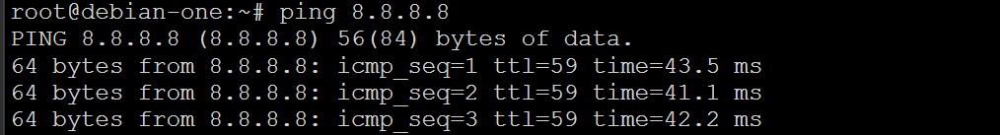
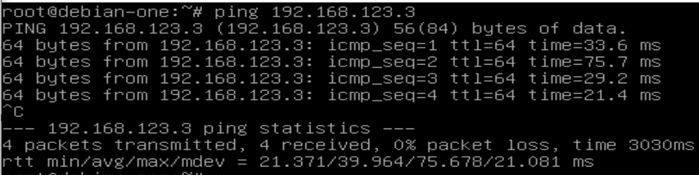
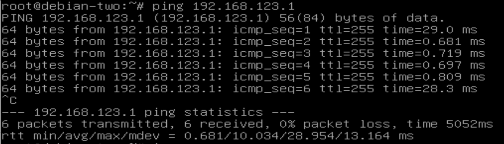
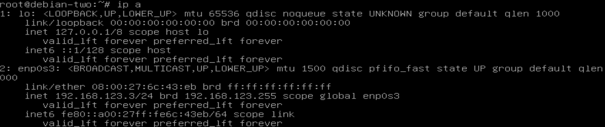
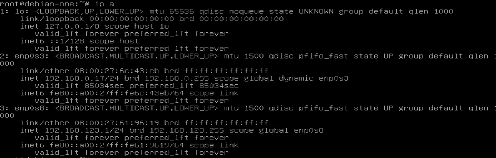
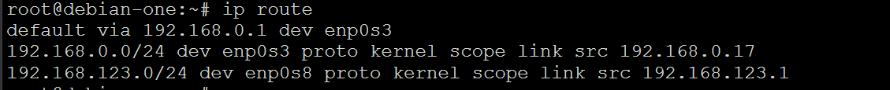
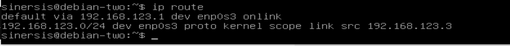
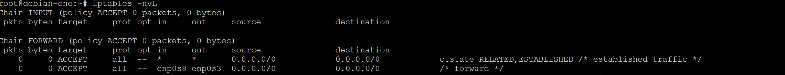
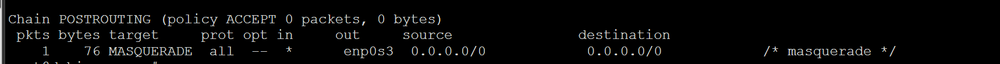

# Домашнее задание по лекции "4.9. Firewall"

#### [Задание №1](#задание-1-текст-задания)

### Задание №1 ([Текст Задания](https://github.com/netology-code/snet-homeworks/blob/main/4-09.md#%D0%B7%D0%B0%D0%B4%D0%B0%D0%BD%D0%B8%D0%B5-1))

Единственное чего я так и не добился это пинг второй 
машины VM_2 в интернет, и от эксперта я тоже не получил ответа.
Так что сдаю без него в надежде что мне подскажут где я ошибся.

При этом VM_1 которая является шлюзом в интернет смотрит нормально.

