# Домашнее задание по лекции "4.7 Высокоуровневые протоколы"

#### [Задание №1](#задание-1-текст-задания)
#### [Задание №2](#задание-2-текст-задания)
#### [Задание №3](#задание-3-текст-задания)

### Задание №1 ([Текст Задания](https://github.com/netology-code/snet-homeworks/blob/main/4-07.md#%D0%B7%D0%B0%D0%B4%D0%B0%D0%BD%D0%B8%D0%B5-1))

1. Telnet -23
2. SSH - 22
3. FTP - 21
4. SNMP - 161,162

---

### Задание №2 ([Текст Задания](https://github.com/netology-code/snet-homeworks/blob/main/4-07.md#%D0%B7%D0%B0%D0%B4%D0%B0%D0%BD%D0%B8%D0%B5-2))

Формулу расчета я позаимствовал с лекции и прогнал все через python (простите не оказалось под рукой калькулятора)

{5,21} - был ключом к шифрованию
(7 ** 5) % 21 - получилась вот такая формула в Python
7 - результат работы формулы

Я конечно могу быть в корне не прав, но математика так и работает, берем то что дано подставляем в формулу и готово.
Собственно ниже приложу пример шифрования по ключу. Я просто сделал аналогию.
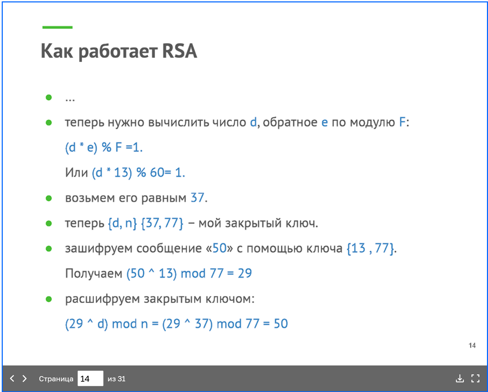

---

### Задание №3 ([Текст Задания](https://github.com/netology-code/snet-homeworks/blob/main/4-07.md#%D0%B7%D0%B0%D0%B4%D0%B0%D0%BD%D0%B8%D0%B5-3))

1. Генерируем ключ
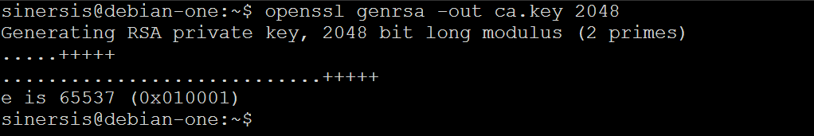
2. Генерируем корневой сертификат. Поля в сертификате указываем любые.
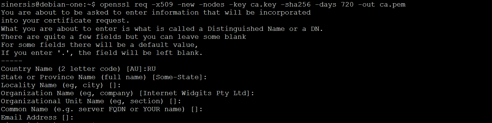
3. Сразу же сделаем сертификат в форме crt
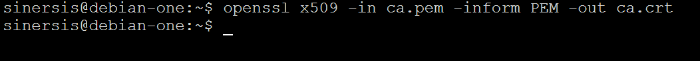
4. Далее установим сертификат в систему. Ниже пример для Ubuntu/Debian систем
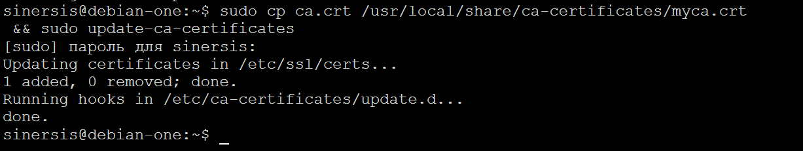
5. Приступим к выпуску самого сертификата:
   1. Генерируем ключи
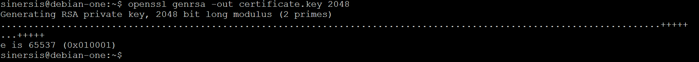
   2. На основе ключа создаем CSR
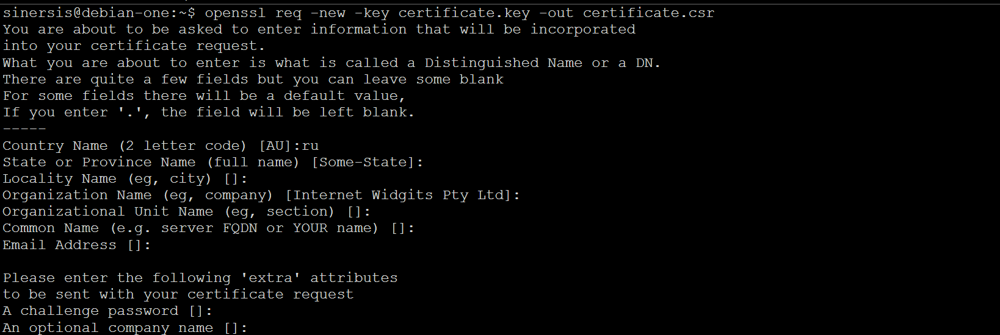
   3. Подписываем CSR нашим корневым сертификатом. Тем самым создаем конечный сертификат.
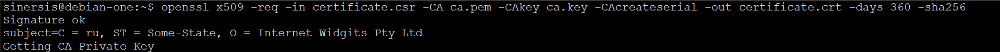
6. Проверяем валидность сертификата
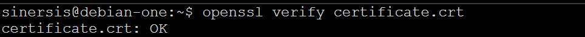

Ответ:

`openssl x509 -subject -issuer -noout -in ca.pem`
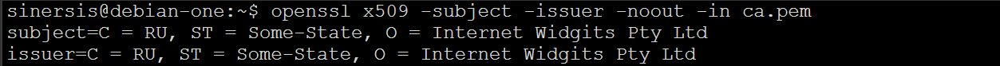

`openssl x509 -subject -issuer -noout -in certificate.crt`
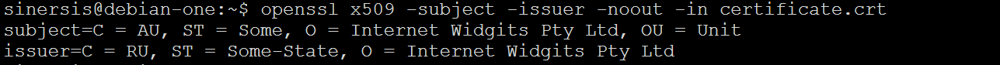

`openssl verify certificate.crt`

