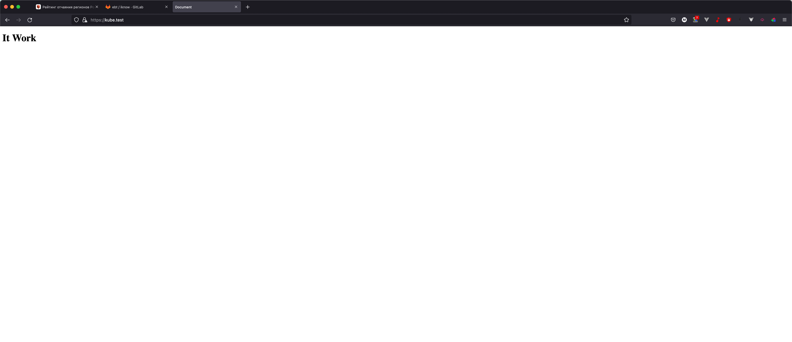
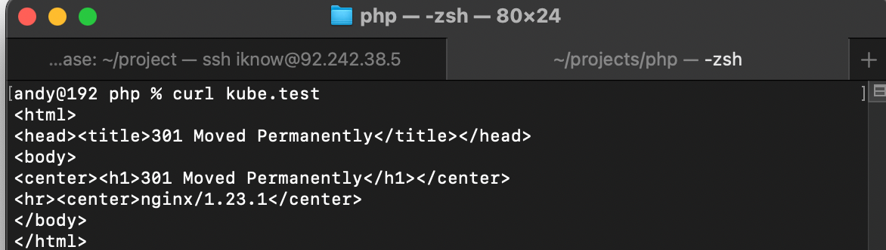

# Домашнее задание по лекции "4.11. DNS"

#### [Задание №1](#задание-1-текст-задания)
#### [Задание №2](#задание-2-текст-задания)
#### [Задание №3](#задание-2-текст-задания)

### Задание №1 ([Текст Задания](https://github.com/netology-code/snet-homeworks/blob/main/4-11.md#%D0%B7%D0%B0%D0%B4%D0%B0%D0%BD%D0%B8%D0%B5-1))

- Данная страница не найдена - 404;
- Страница была перенесена на новый сайт - 301;
- Ресурс удален - 410;
- Пользователь не авторизован для просмотра страницы - -401;
- Превышен лимит запросов от пользователя - 429;

---

### Задание №2 ([Текст Задания](https://github.com/netology-code/snet-homeworks/blob/main/4-11.md#%D0%B7%D0%B0%D0%B4%D0%B0%D0%BD%D0%B8%D0%B5-2))

Думаю не кретично если домен будет другим

---

### Задание №3 ([Текст Задания](https://github.com/netology-code/snet-homeworks/blob/main/4-11.md#%D0%B7%D0%B0%D0%B4%D0%B0%D0%BD%D0%B8%D0%B5-3))

---
