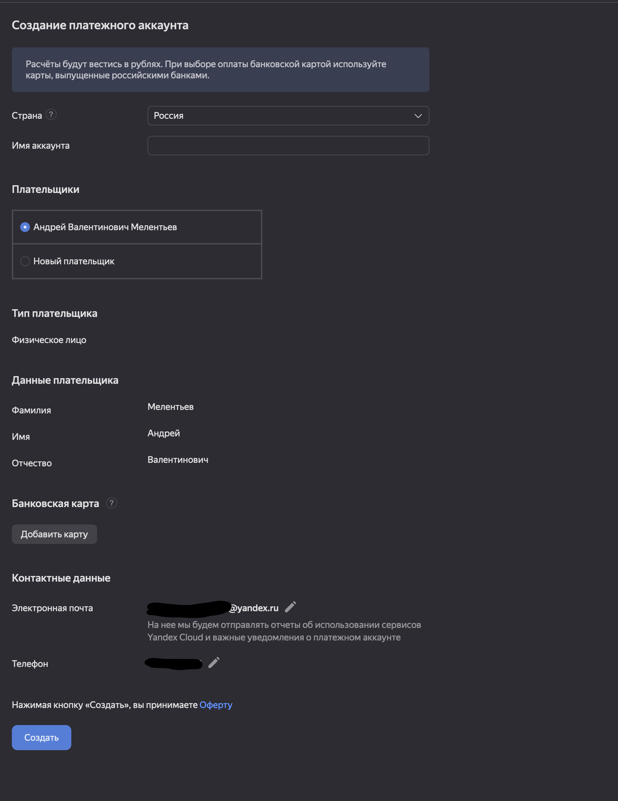
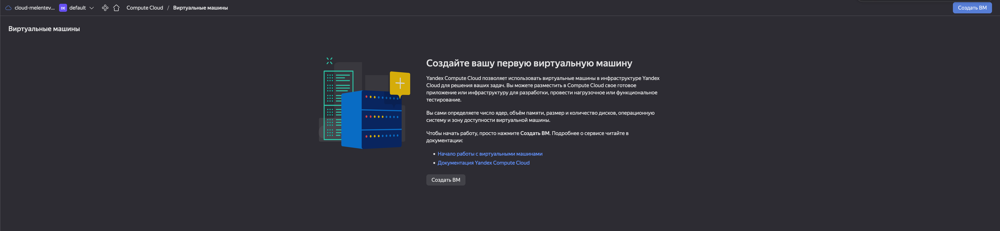
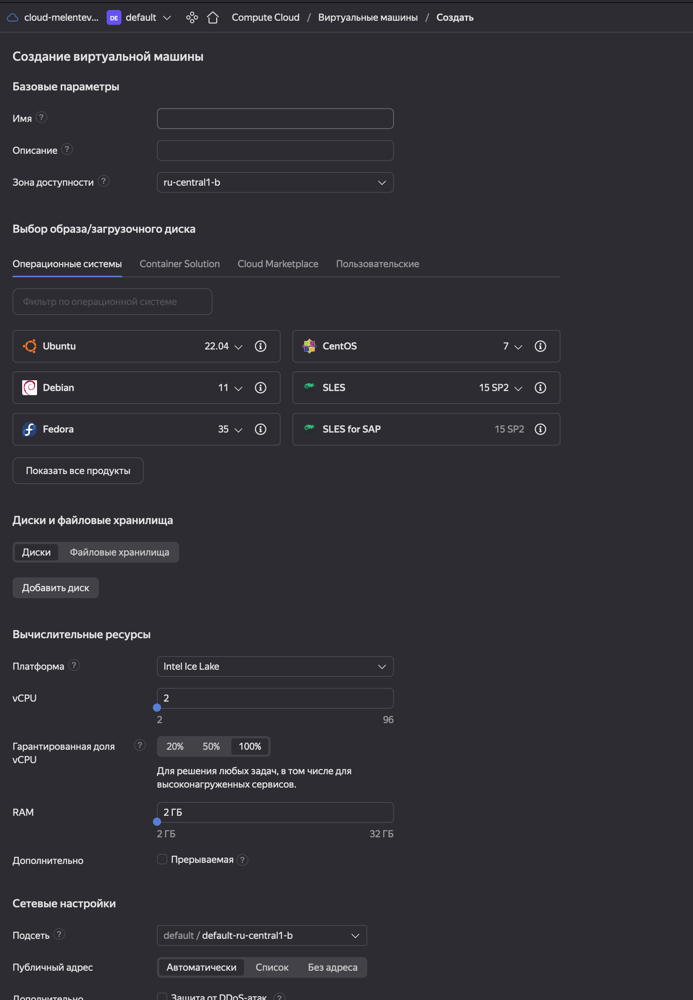

# Домашнее задание по лекции "6.1. Виртуализация и облачные решения: AWS, GCP, Яндекс.Облако, Openstack"

#### [Задание №1](#задание-1-текст-задания)
#### [Задание №2](#задание-2-текст-задания)
#### [Задание №3](#задание-2-текст-задания)

### Задание №1 ([Текст Задания](https://github.com/netology-code/sdvps-homeworks/blob/main/6-01.md#%D0%B7%D0%B0%D0%B4%D0%B0%D0%BD%D0%B8%D0%B5-1))

Публичное и общедоступное облако в принципе мало чем отличаются, они открыты для использования всем у кого есть желание 
и деньги, фактически синонимы согласно словарю VMWare.

Частное облако это по факту закрытое облако, кроме того его можно развернуть либо на своих мощностях либо на 
инфраструктуре поставщика такого облака. 

Гибридное в корне отличается от двух вышеупомянутых, а отличается оно тем что в его составе есть как минимум одно 
частное облако и одно публичное, и конечно же позволяет управлять этими двумя облачными структурами.

---

### Задание №2 ([Текст Задания](https://github.com/netology-code/sdvps-homeworks/blob/main/6-01.md#%D0%B7%D0%B0%D0%B4%D0%B0%D0%BD%D0%B8%D0%B5-2))

1. IaaS - это **_"Infrastructure as a service"_** инфраструктура как сервис (Пример:  IBM Softlayer, Hetzner Cloud, Microsoft Azure, Amazon EC2, GigaCloud);
2. PaaS - это **_"Platform as a service"_** платформа как сервис (Пример: Google App Engine, IBM Bluemix, Microsoft Azure, VMWare Cloud Foundry);
3. SaaS - это **_"Software as a service"_** программное обеспечение как сервис (Пример: РосБизнесСофт, AmoCRM, Hubspot, Salesforce, ERP, ОЛИМП, Контур, Yaware, Worksection);
4. CaaS - это "**_Containers as a Service"_** контейнер как сервис (Пример: Google Container Engine, IBM Kubernetes Service);
5. DRaaS - это "**_Data recovery as a service"_** восстановление данных как сервис (Пример: Commvault Simpana, Dell EMC Avamar, Veritas Resiliency Platform и Veritas InfoScale, VMware vCloud Availability);
6. BaaS - это "**_Backup as a service"_** резервное копирование как сервис (Пример: AWS Backup);
7. DBaaS - это **_"Database as a service"_** база данных как сервис (Пример: Amazon Web Service);
8. MaaS - это "**_Monitoring as a service"_** мониторинг как сервис (Пример: Anturis);
9. DaaS - это **_"Desktop as a service"_** удаленный рабочий стол как сервис (Пример: Amazon WorkSpaces);
10. NaaS - это **_"Network as a service"_** сеть как сервис (Пример: Microsoft Azure);
11. STaaS - это **_"Storage as a service"_** хранение как сервис (Пример: Amazon Web Services, Microsoft Azure, Google Cloud);

Тут могут быть промахи, так как под одними и теми же аббревиатурами образовалось множество услуг как сервис

---

### Задание №3 ([Текст Задания](https://github.com/netology-code/sdvps-homeworks/blob/main/6-01.md#%D0%B7%D0%B0%D0%B4%D0%B0%D0%BD%D0%B8%D0%B5-3))

1. Управляет всеми процессами провайдер (SaaS);
2. Вы управляете приложением и данными, остальным управляет провайдер (SaaS);
3. Вы управляете операционной системой, средой исполнения, данными, приложениями, остальными управляет провайдер (IaaS, PaaS);
4. Вы управляете сетью, хранилищами, серверами, виртуализацией, операционной системой, средой исполнения, данными, приложениями (IaaS);

---

### Задание №4 ([Текст Задания](https://github.com/netology-code/sdvps-homeworks/blob/main/6-01.md#%D0%B7%D0%B0%D0%B4%D0%B0%D0%BD%D0%B8%D0%B5-4))

1. Создать аккаунт (платежный)

2. После регистрации выбрать меню в консоли Computer cloud.

3. Приступить к созданию виртуальной машины.

1. Какие ОС можно выбрать?
- Ubuntu
- Debian
- CentOS
- Fedora
- OpenSUSE
- SLES
- AlmaLinux
- Astra
- RedOS
- ALT
2. Какие параметры сервера можно выбрать?
- Платформа
- vCPU
- Гарантированная доля vCPU
- RAM
- Подсеть
- Публичный адрес
- Внутренний IPv4-адрес

3. Какие компоненты мониторинга можно создать?
- Yandex Monitoring
- Cloud Logging

4. Какие системы безопасности предусмотрены?
- Защита от DDOS-атак

5. Как меняется цена от выбранных характеристик? Приведите пример самой дорогой конфигурации и самой дешевой.

Цена меняется в зависимости от того как много дополнительных опций мы подключаем или от того насколько мощную 
конфигурацию мы хотим получить

Дорогая конфигурация: 294 218,60 в месяц
Дешевая конфигурация: 562,20 в месяц

---
