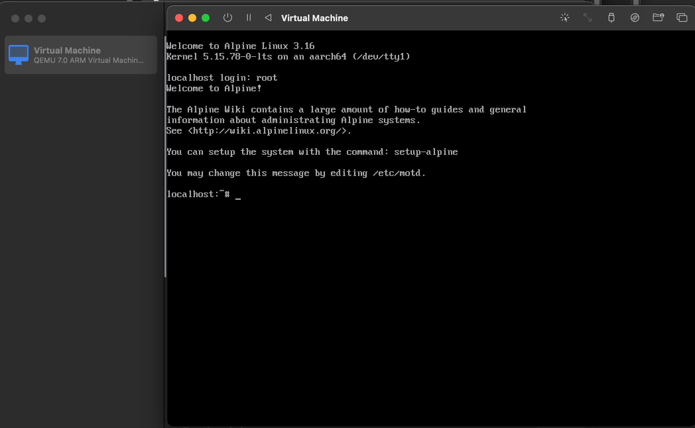
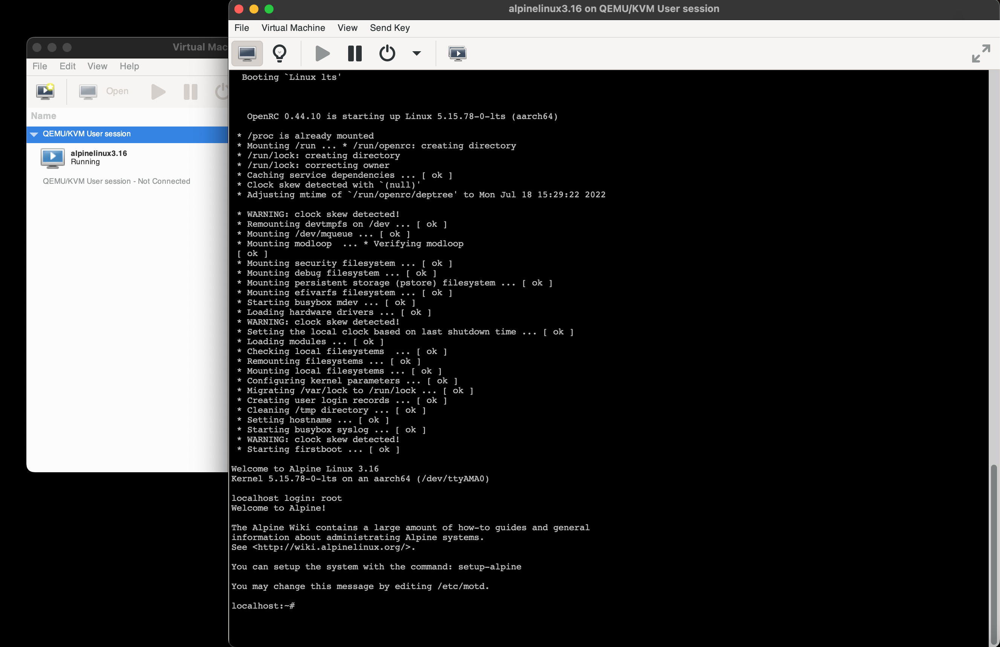
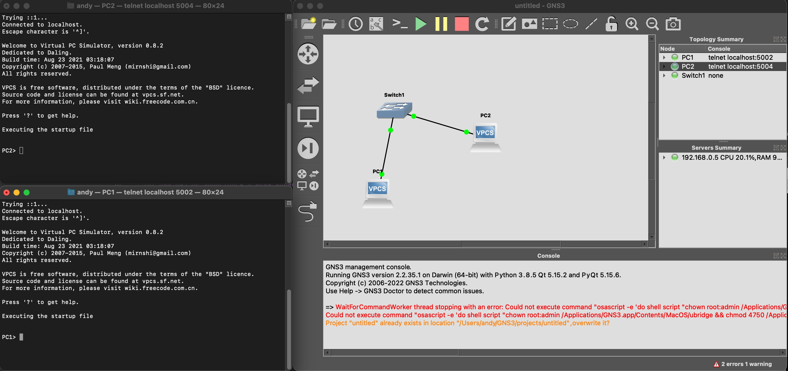

# Домашнее задание по лекции "6.1. Виртуализация и облачные решения: AWS, GCP, Яндекс.Облако, Openstack"

#### [Задание №1](#задание-1-текст-задания)
#### [Задание №2](#задание-2-текст-задания)
#### [Задание №3](#задание-3-текст-задания)
#### [Задание №4](#задание-4-текст-задания)

### Задание №1 ([Текст Задания](https://github.com/netology-code/sdvps-homeworks/blob/main/6-02.md#%D0%B7%D0%B0%D0%B4%D0%B0%D0%BD%D0%B8%D0%B5-1))
1. Аппаратная - При аппаратной виртуализации на сервере-хосте устанавливается обычная операционная система и создаются 
полностью изолированные друг от друга виртуальные машины, каждая из которых имеет свою собственную полноценную ОС и 
использует в работе ее ядро (KVM, XEN)
2. Программная - Разделение ресурсов сервера осуществляется средствами операционной системы, и все виртуальные машины 
используют общее программное ядро (OpenVZ, Virtuozzo)
---

### Задание №2 ([Текст Задания](https://github.com/netology-code/sdvps-homeworks/blob/main/6-02.md#%D0%B7%D0%B0%D0%B4%D0%B0%D0%BD%D0%B8%D0%B5-2))

---

### Задание №3 ([Текст Задания](https://github.com/netology-code/sdvps-homeworks/blob/main/6-02.md#%D0%B7%D0%B0%D0%B4%D0%B0%D0%BD%D0%B8%D0%B5-3))

---

### Задание №4 ([Текст Задания](https://github.com/netology-code/sdvps-homeworks/blob/main/6-02.md#%D0%B7%D0%B0%D0%B4%D0%B0%D0%BD%D0%B8%D0%B5-4))

---
