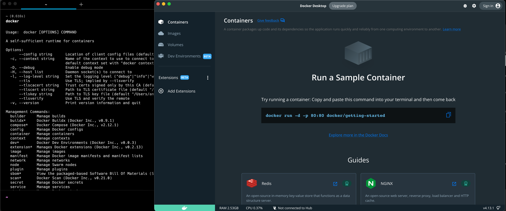
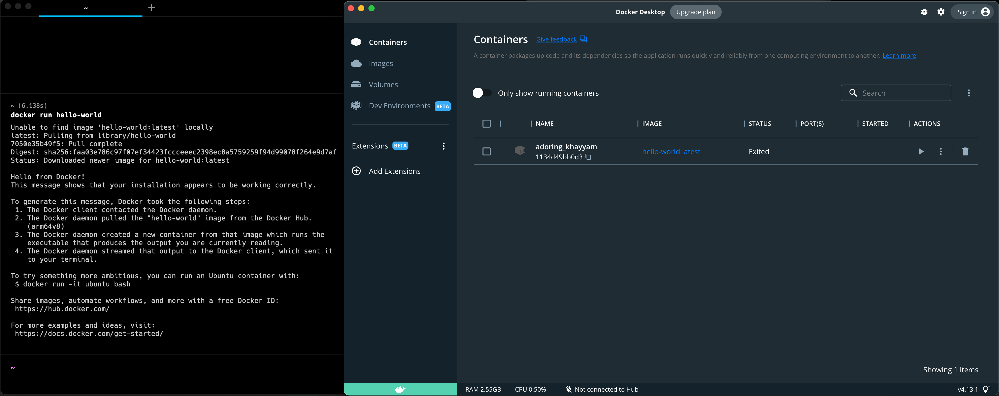
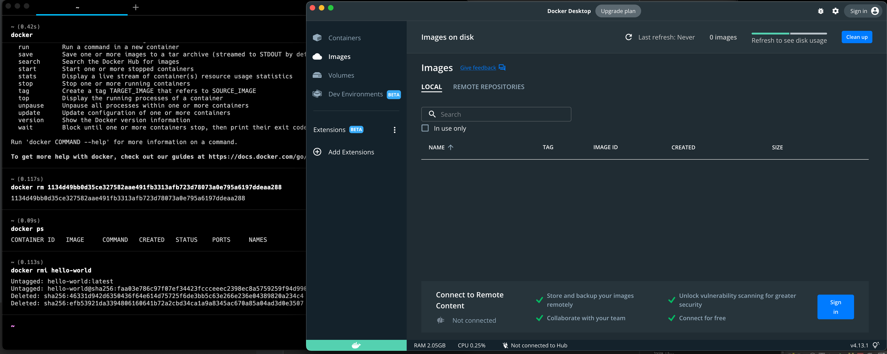

# Домашнее задание по лекции "6.3. Docker"

#### [Задание №1](#задание-1-текст-задания)
#### [Задание №2](#задание-2-текст-задания)
#### [Задание №3](#задание-3-текст-задания)
#### [Задание №4](#задание-4-текст-задания)

### Задание №1 ([Текст Задания](https://github.com/netology-code/sdvps-homeworks/blob/main/6-03.md#%D0%B7%D0%B0%D0%B4%D0%B0%D0%BD%D0%B8%D0%B5-1))

Разница в том что виртуальные машины по сути эмулируют компьютер полностью, а контейнеры по сути только операционную 
систему и все что выше

---

### Задание №2 ([Текст Задания](https://github.com/netology-code/sdvps-homeworks/blob/main/6-03.md#%D0%B7%D0%B0%D0%B4%D0%B0%D0%BD%D0%B8%D0%B5-2))

---

### Задание №3 ([Текст Задания](https://github.com/netology-code/sdvps-homeworks/blob/main/6-03.md#%D0%B7%D0%B0%D0%B4%D0%B0%D0%BD%D0%B8%D0%B5-3))

---

### Задание №4 ([Текст Задания](https://github.com/netology-code/sdvps-homeworks/blob/main/6-03.md#%D0%B7%D0%B0%D0%B4%D0%B0%D0%BD%D0%B8%D0%B5-4))

---
