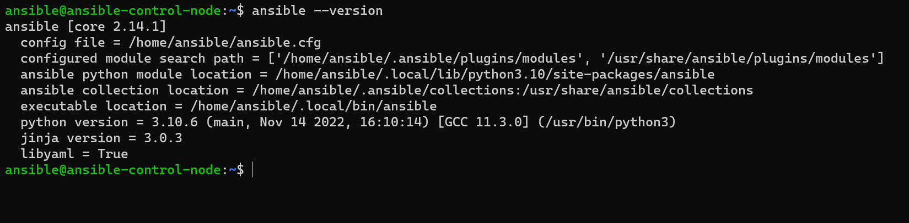

# Домашнее задание по лекции "7.1. Ansible"

#### [Задание №1](#задание-1-текст-задания)
#### [Задание №2](#задание-2-текст-задания)
#### [Задание №3](#задание-3-текст-задания)
#### [Задание №4](#задание-4-текст-задания)
#### [Задание №5](#задание-5-текст-задания)

---

### Задание №1 ([Текст Задания](https://github.com/netology-code/sdvps-homeworks/blob/main/7-01.md#%D0%B7%D0%B0%D0%B4%D0%B0%D0%BD%D0%B8%D0%B5-1))

Если коротко и после прочтения незаслуженно короткого вики, то цена, скорость и уменьшение рисков.

А если своими словами, то в первую очередь это возможность автоматизации развертывания и управления серверами.

---

### Задание №2 ([Текст Задания](https://github.com/netology-code/sdvps-homeworks/blob/main/7-01.md#%D0%B7%D0%B0%D0%B4%D0%B0%D0%BD%D0%B8%D0%B5-2))

### [Файл: inventory](assets/ansible/hw-35/inventory)

---

### Задание №3 ([Текст Задания](https://github.com/netology-code/sdvps-homeworks/blob/main/7-01.md#%D0%B7%D0%B0%D0%B4%D0%B0%D0%BD%D0%B8%D0%B5-3))

Если совсем условно, то FORKS это количество одновременно обрабатываемых узлов на каждую запущенную задачу, а SERIAL это
ограничитель одновременно выполняемых задач.

---

### Задание №4 ([Текст Задания](https://github.com/netology-code/sdvps-homeworks/blob/main/7-01.md#%D0%B7%D0%B0%D0%B4%D0%B0%D0%BD%D0%B8%D0%B5-4))
1. `ansible -b all -m apt -a "name=mc state=latesrt"`

2. `ansible -b all -m command -a "sudo systemctl status systemd-timesyncd"`

3. `ansible -b all -m shell -a "echo 'I like Linux' > /tmp/netology.txt && cat /tmp/netology.txt"`

---

### Задание №5 ([Текст Задания](https://github.com/netology-code/sdvps-homeworks/blob/main/7-01.md#%D0%B7%D0%B0%D0%B4%D0%B0%D0%BD%D0%B8%D0%B5-5))

1. [Файл playbook: kafka.yml](assets/ansible/hw-35/playbooks/kafka.yml)

2. [Файл playbook: tuned.yml](assets/ansible/hw-35/playbooks/tuned.yml)

3. [Файл playbook: motd.yml](assets/ansible/hw-35/playbooks/motd.yml)

---