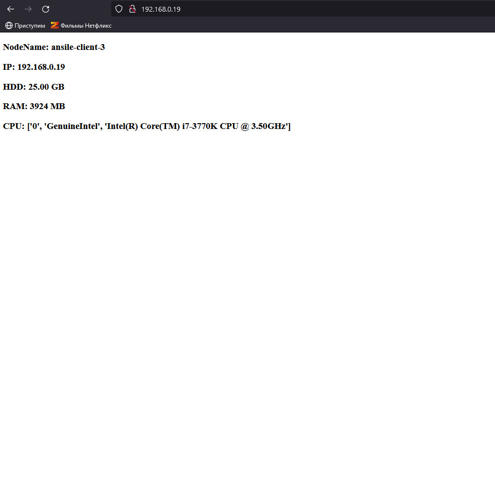

# Домашнее задание по лекции "7.1. Ansible"

#### [Задание №6](#задание-6-текст-задания)
#### [Задание №7](#задание-7-текст-задания)

---

### Задание №6 ([Текст Задания](https://github.com/netology-code/sdvps-homeworks/blob/main/7-01.md#%D0%B7%D0%B0%D0%B4%D0%B0%D0%BD%D0%B8%D0%B5-6))

[Файл playbook: motd.yml](assets/ansible/hw-36/playbooks/motd.yml)

---

### Задание №7 ([Текст Задания](https://github.com/netology-code/sdvps-homeworks/blob/main/7-01.md#%D0%B7%D0%B0%D0%B4%D0%B0%D0%BD%D0%B8%D0%B5-7))

#### [Файл zip_role](assets/ansible/hw-36/playbooks/roles.zip)
#### [Файл playbook: nginx.yml](assets/ansible/hw-36/playbooks/nginx.yml)
#### [Файл roles/tasks](assets/ansible/hw-36/playbooks/roles/apache/tasks/main.yml)
#### [Файл roles/handlers](assets/ansible/hw-36/playbooks/roles/apache/handlers/main.yml)
#### [Файл roles/templates](assets/ansible/hw-36/playbooks/roles/apache/templates/index.html)

---