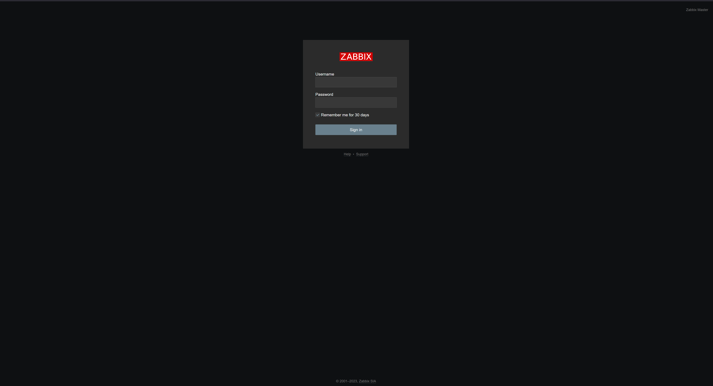

# Домашнее задание по лекции 9.2 "Zabbix. Часть 1"

#### [Задание №1](#задание-1-текст-задания)

---
### Задание №1 ([Текст Задания](https://github.com/netology-code/srlb-homework/blob/srlb-14/9-02.md#%D0%B7%D0%B0%D0%B4%D0%B0%D0%BD%D0%B8%D0%B5-1))

```bash
sudo apt install postgresql
```

```bash
sudo wget https://repo.zabbix.com/zabbix/6.0/ubuntu/pool/main/z/zabbix-release/zabbix-release_6.0-4%2Bubuntu22.04_all.deb
sudo dpkg -i zabbix-release_6.0-4+ubuntu22.04_all.deb
sudo apt update 
```

```bash
apt install zabbix-server-pgsql zabbix-frontend-php php8.1-pgsql zabbix-nginx-conf zabbix-sql-scripts zabbix-agent
```

```bash
sudo -u postgres createuser --pwprompt zabbix
sudo -u postgres createdb -O zabbix zabbix 
```

```bash
zcat /usr/share/zabbix-sql-scripts/postgresql/server.sql.gz | sudo -u zabbix psql zabbix
```

```bash
sed -i 's/# DBPassword=/DBPassword=12341234/g' /etc/zabbix/zabbix_server.conf
```



---

### Задание №2 ([Текст Задания](https://github.com/netology-code/srlb-homework/blob/srlb-14/9-02.md#%D0%B7%D0%B0%D0%B4%D0%B0%D0%BD%D0%B8%D0%B5-2))

```bash
apt install zabbix-agent
```

```bash
sed -i 's/Server=127.0.0.1/Server=192.168.0.19/g' /etc/zabbix/zabbix_agentd.conf
```


---