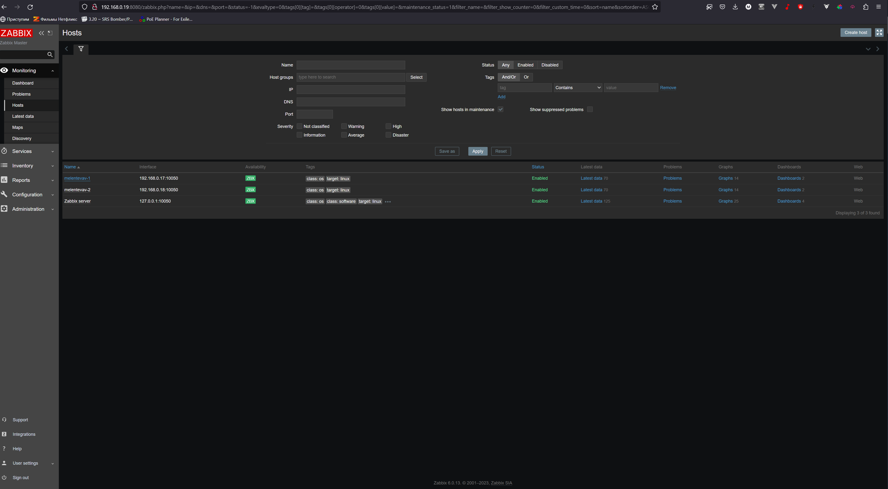

# Домашнее задание по лекции 9.2 "Zabbix. Часть 2"

#### [Задание №1](#задание-1-текст-задания)

---
### Задание №1 ([Текст Задания](https://github.com/netology-code/srlb-homework/blob/srlb-14/9-03.md#%D0%B7%D0%B0%D0%B4%D0%B0%D0%BD%D0%B8%D0%B5-1))

---

### Задание №2 и Задание №3 ([Текст Задания](https://github.com/netology-code/srlb-homework/blob/srlb-14/9-03.md#%D0%B7%D0%B0%D0%B4%D0%B0%D0%BD%D0%B8%D0%B5-3))

---

### Задание №4 ([Текст Задания](https://github.com/netology-code/srlb-homework/blob/srlb-14/9-03.md#%D0%B7%D0%B0%D0%B4%D0%B0%D0%BD%D0%B8%D0%B5-4))

---