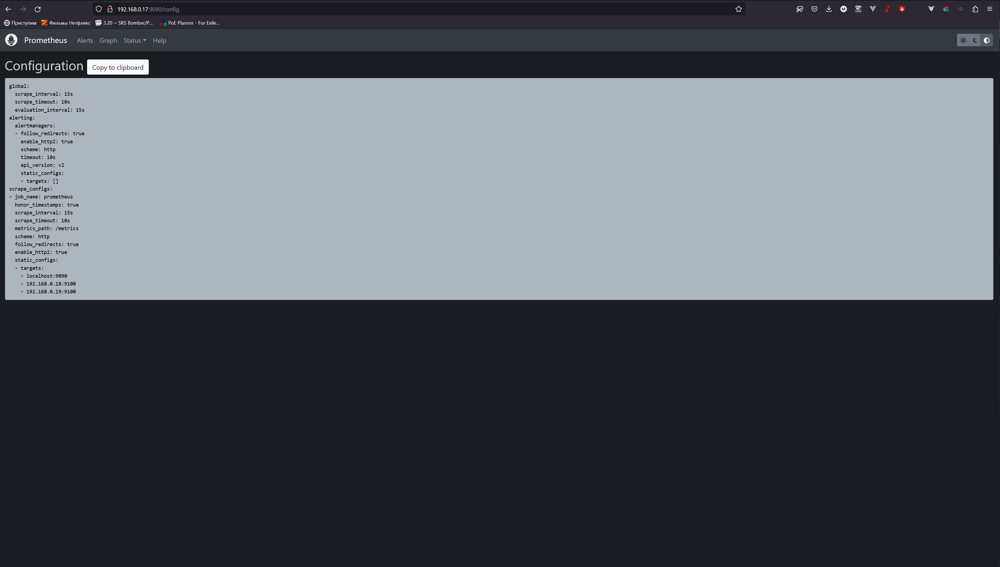

# Домашнее задание по лекции 9.4 "Prometheus"

#### [Задание №1](#задание-1-текст-задания)
#### [Задание №2](#задание-2-текст-задания)
#### [Задание №3](#задание-3-текст-задания)
#### [Задание №4](#задание-4-текст-задания)
#### [Задание №5](#задание-5-текст-задания)

---
### Задание №1 ([Текст Задания](https://github.com/netology-code/srlb-homework/blob/srlb-14/9-04.md#%D0%B7%D0%B0%D0%B4%D0%B0%D0%BD%D0%B8%D0%B5-1))

---

### Задание №2 ([Текст Задания](https://github.com/netology-code/srlb-homework/blob/srlb-14/9-04.md#%D0%B7%D0%B0%D0%B4%D0%B0%D0%BD%D0%B8%D0%B5-2))

Client #1

Client #2

___

### Задание №3 ([Текст Задания](https://github.com/netology-code/srlb-homework/blob/srlb-14/9-04.md#%D0%B7%D0%B0%D0%B4%D0%B0%D0%BD%D0%B8%D0%B5-3))

___

### Задание №4 ([Текст Задания](https://github.com/netology-code/srlb-homework/blob/srlb-14/9-04.md#%D0%B7%D0%B0%D0%B4%D0%B0%D0%BD%D0%B8%D0%B5-4))

___

### Задание №5 ([Текст Задания](https://github.com/netology-code/srlb-homework/blob/srlb-14/9-04.md#%D0%B7%D0%B0%D0%B4%D0%B0%D0%BD%D0%B8%D0%B5-5))

___