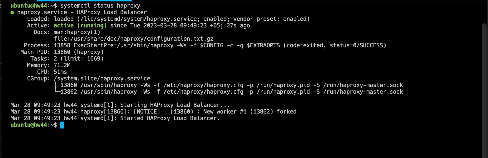
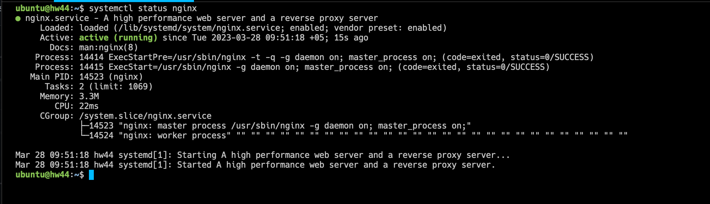
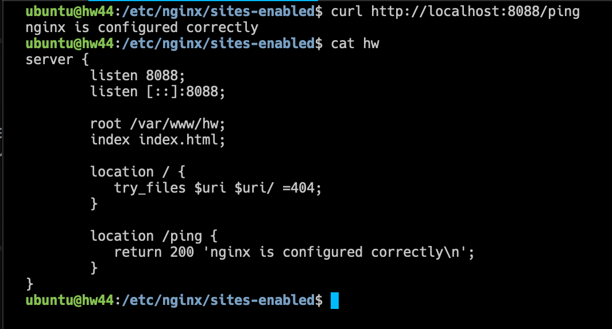

# Домашнее задание по лекции 10.1 «Балансировка нагрузки.
HAProxy/Nginx»

#### [Задание №1](#задание-1-текст-задания)
#### [Задание №2](#задание-2-текст-задания)
#### [Задание №3](#задание-3-текст-задания)
#### [Задание №4](#задание-4-текст-задания)
#### [Задание №5](#задание-5-текст-задания)

---

### Задание №1 ([Текст Задания](https://github.com/netology-code/srlb-homework/blob/srlb-14/10-05.md#%D0%B7%D0%B0%D0%B4%D0%B0%D0%BD%D0%B8%D0%B5-1))

Балансировка нагрузки необходима в первую очередь для обеспечения отказоустойчивости и доступности ресурсов, если в общих словах
то балансировщик помогает распределить все запросы приходящие на него равномерно между всеми сервисами.

---

### Задание №2 ([Текст Задания](https://github.com/netology-code/srlb-homework/blob/srlb-14/10-05.md#%D0%B7%D0%B0%D0%B4%D0%B0%D0%BD%D0%B8%D0%B5-2))

Round Robin - по сути перебор доступных (указанных) серверов в цикле

Weighted Round Robin - Тоже перебор доступных (указанных) серверов в цикле, но теперь еще у них появляются 
"веса", чем больше вес тем раньше к нему поступят обращения

---

### Задание №3 ([Текст Задания](https://github.com/netology-code/srlb-homework/blob/srlb-14/10-05.md#%D0%B7%D0%B0%D0%B4%D0%B0%D0%BD%D0%B8%D0%B5-3))

---

### Задание №4 ([Текст Задания](https://github.com/netology-code/srlb-homework/blob/srlb-14/10-05.md#%D0%B7%D0%B0%D0%B4%D0%B0%D0%BD%D0%B8%D0%B5-4))

---

### Задание №5 ([Текст Задания](https://github.com/netology-code/srlb-homework/blob/srlb-14/10-05.md#%D0%B7%D0%B0%D0%B4%D0%B0%D0%BD%D0%B8%D0%B5-5))

---
