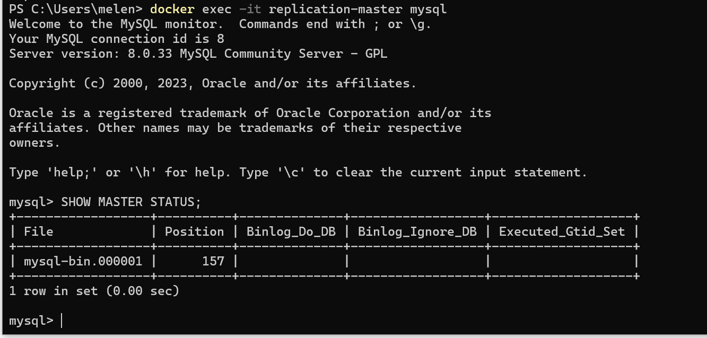
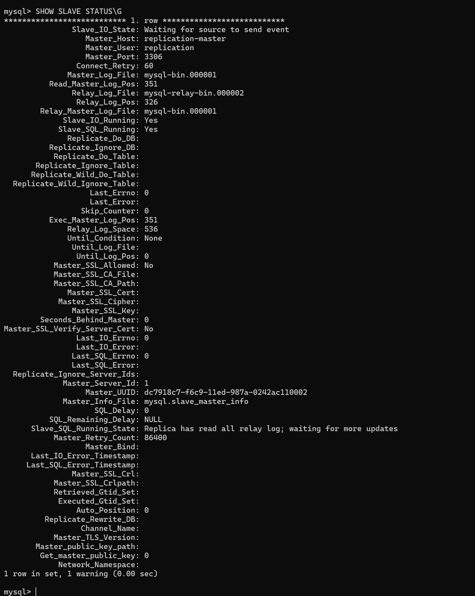

# Домашнее задание по лекции 12.6 «Репликация и масштабирование. Часть 1»

#### [Задание №1](#задание-1-текст-задания)
#### [Задание №2](#задание-2-текст-задания)

---

### Задание №1 ([Текст Задания](https://github.com/netology-code/sdb-homeworks/blob/main/12-06.md#%D0%B7%D0%B0%D0%B4%D0%B0%D0%BD%D0%B8%D0%B5-1))

В целом различий не так много.

В случае master -> slave у вас есть четкое распределение ролей master пишет, slave копирует и читает. Тут главное чтобы
не было ситуаций в которых slave начинает критично отставать.

В случае с master <-> master, как бы тут один подменяет другого, а так как оба могут выполнять полный список CRUD операций
то это немного боле надежный способ, но он становиться более избыточный.

---

### Задание №2 ([Текст Задания](https://github.com/netology-code/sdb-homeworks/blob/main/12-06.md#%D0%B7%D0%B0%D0%B4%D0%B0%D0%BD%D0%B8%D0%B5-2))

---

