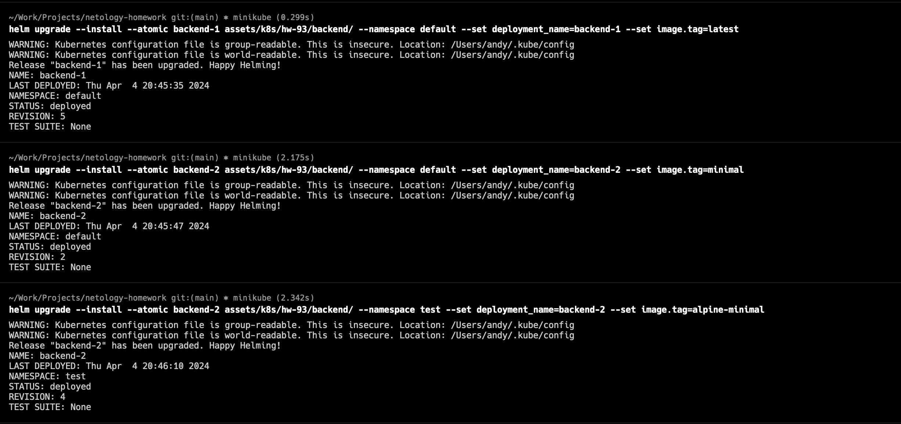
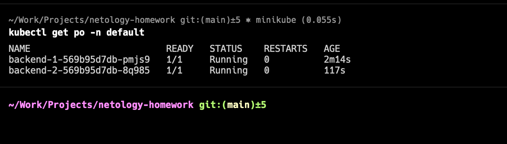
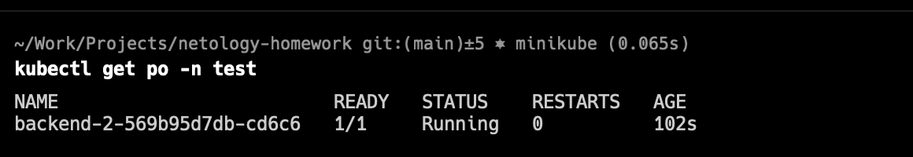

# Домашнее задание по лекции «Helm»

---

Задание 1. Подготовить Helm-чарт для приложения

Папка с Helm: [backend](assets/k8s/hw-93/backend)

Задание 2. Запустить две версии в разных неймспейсах

Запуск helm:

Проверка 2х deployments в одном namespace default:

Проверка deployments в namespace test:
