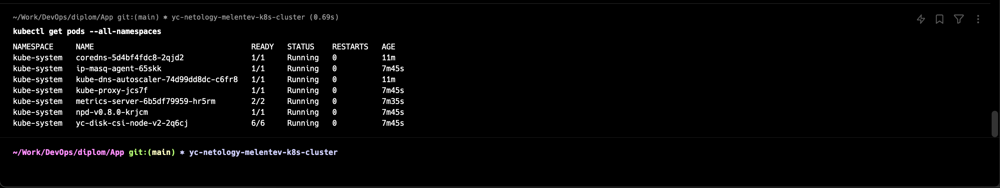

Дипломная работа
---

---

### Создание облачной инфраструктуры

#### Git Repo:    [Terraform Manifests](https://gitlab.com/netology-diplom/terraform)

#### Bucket Part: [Bucket Manifests](https://gitlab.com/netology-diplom/terraform/-/blob/main/bucket/0-main.tf?ref_type=heads)

#### VPC Part:    [VPC Manifests](https://gitlab.com/netology-diplom/terraform/-/blob/main/infrastructure/1-vpc.tf?ref_type=heads)

---

### Создание Kubernetes кластера

#### Git Repo: [Terraform Manifests](https://gitlab.com/netology-diplom/terraform)

#### K8S Part: [K8S Manifests](https://gitlab.com/netology-diplom/terraform/-/blob/main/infrastructure/2-k8s.tf?ref_type=heads)

#### Command `kubectl get pods --all-namespaces` screenshot:

---

### Создание тестового приложения

#### Git Repo:       [Dockerized App](https://gitlab.com/netology-diplom/docker-app)

#### Registry Image: [App Image](registry.gitlab.com/netology-diplom/docker-app:app-710ecc7260b0fc1299238e077d6075d1bcc65a81)

---

### Подготовка cистемы мониторинга и деплой приложения

#### Git Repo: [Monitoring Manifests](https://gitlab.com/netology-diplom/monitoring-stack)

#### Link to Demo App: [Demo App](http://158.160.139.76/)

#### Link to Grafana: [Grafana App](http://158.160.171.9/)
#### Grafana User: admin
#### Grafana PWD: 1209345678

---

### Установка и настройка CI/CD

#### CI\CD: [Link to CI\CD page](https://gitlab.com/netology-diplom/docker-app/-/pipelines)

#### Pipeline without tag: [Pipeline](https://gitlab.com/netology-diplom/docker-app/-/pipelines/1317768185)

#### Pipeline with tag and deploy to k8s: [Pipeline](https://gitlab.com/netology-diplom/docker-app/-/pipelines/1317817094)
